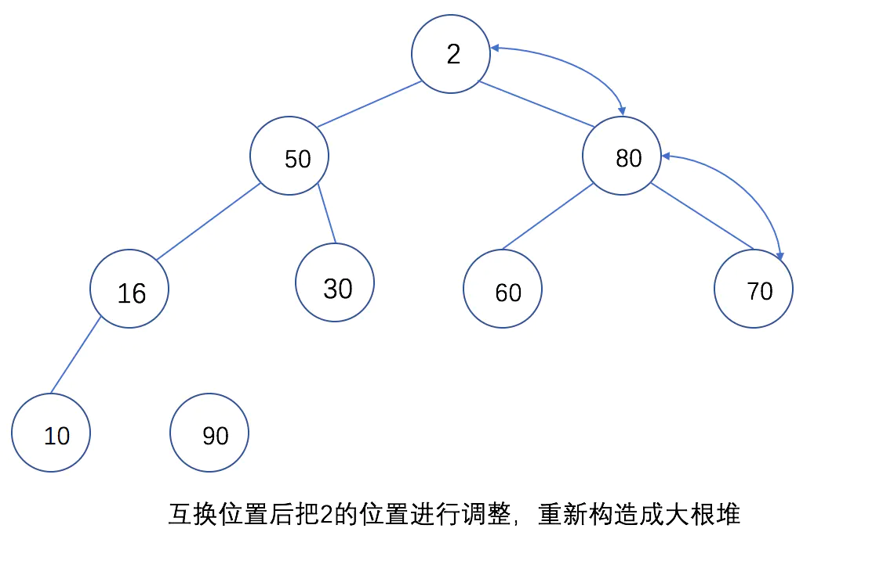

```

```

# 堆排序的Python实现(附详细过程图和讲解)

[](https://www.jianshu.com/u/2cab7d1e745c)

[一根薯条](https://www.jianshu.com/u/2cab7d1e745c)关注

52018.03.28 09:21:05字数 1,857阅读 42,395

### 正文前的扯淡

之前电话面试一个公司时，面试官让写一个堆排序，遗憾的是我忘了堆排序的思想了，所以直接说不会写，这次电面也以失败告终...知耻后勇，这几天在网上找了很多写堆排序的帖子，但是帖子质量不好，堆排序是什么不介绍，代码也非常不详细，看了半天没整明白，不过好在今天找出了数据结构课的课本，系统复习后，尝试用Python写出了一个堆排序。


### 目录

- 堆排序介绍

- 堆排序算法详解+Python实现

  

### 堆排序涉及到的概念

- 堆排序是利用 **堆**进行排序的

- **堆**是一种完全二叉树

- **堆**有两种类型: **大根堆** **小根堆**

- 两种类型的概念如下：
  大根堆：每个结点的值都大于或等于左右孩子结点
  小根堆：每个结点的值都小于或等于左右孩子结点
  因为比较抽象，所以专门花了两个图表示

  

  大根堆

  

  小根堆

那么，什么是完全二叉树呢？

**完全二叉树** 是 一种除了最后一层之外的其他每一层都被完全填充，并且所有结点都保持向左对齐的树，向左对齐指的是：


向左对齐的完全二叉树


像这样的树就不是完全二叉树：


image.png


如果给上面的大小根堆的根节点从1开始编号，则满足下面关系(下图就满足这个关系)：


满足关系


如果把这些数字放入数组中，则如下图所示：其中，上面的数字是数组下标值，第一个元素占位用。


数组中的大根堆


### 堆排序算法详解+Python实现

了解了堆。下面我们来看下堆排序的思想是怎样的(以大根堆为例)：

- 首先将待排序的数组构造出一个大根堆
- 取出这个大根堆的堆顶节点(最大值)，与堆的最下最右的元素进行交换，然后把剩下的元素再构造出一个大根堆
- 重复第二步，直到这个大根堆的长度为1，此时完成排序。

### 下面通过图片来看下，第二个步骤是如何进行的：


首先把2和9的位置互换



互换位置后把2的位置进行调整，重新构造出一个大根堆


构造结果如下，这就选出了一个元素，然后再把10和80的位置互换，继续进行上面的步骤

这就是构建大根堆的思想，了解了之后就可以进行编码，编码主要解决两个问题：

- 如何把一个序列构造出一个大根堆
- 输出堆顶元素后，如何使剩下的元素构造出一个大根堆

根据问题进行编码，由于数组下标是从0开始的，而树的节点从1开始，我们还需要引入一个辅助位置，Python提供的原始数据类型list实际上是一个线性表(Array),由于我们需要在序列最左边追加一个辅助位，线性表这样做的话开销很大，需要把数组整体向右移动，所以list类型没有提供形如`appendleft`的函数，但是在一个链表里做这种操作就很简单了，Python的`collections`库里提供了链表结构`deque`，我们先使用它初始化一个无序序列：


```cpp
from collections import deque
L = deque([50, 16, 30, 10, 60,  90,  2, 80, 70])
L.appendleft(0)
```

此时L如下：


```css
In [2]: L
Out[2]: deque([0, 50, 16, 30, 10, 60, 90, 2, 80, 70])
```

根据我们上面找出的两个难点，可以先编出`heap_sort`函数：


```go
def heap_sort(L):
    L_length = len(L) - 1

    first_sort_count = L_length / 2
    for i in range(first_sort_count):
        heap_adjust(L, first_sort_count - i, L_length)

    for i in range(L_length - 1):
        L = swap_param(L, 1, L_length - i)
        heap_adjust(L, 1, L_length - i - 1)

    return [L[i] for i in range(1, len(L))]
```

讲解：

- 因为引入了一个辅助空间，所以使`L_length = len(L) - 1`
- 第一个循环做的事情是把序列调整为一个大根堆(`heap_adjust`函数)
- 第二个循环是把堆顶元素和堆末尾的元素交换(`swap_param`函数)，然后把剩下的元素调整为一个大根堆(`heap_adjust`函数)

我们要排序的序列为`deque([50, 16, 30, 10, 60, 90, 2, 80, 70])`,但是在第一个循环中，我们用了一个辅助变量`first_sort_count`,循环时，这个值变化的顺序是**4->3->2->1**,这是为什么呢。实际上，这些数字代表的是有孩子的节点，从下图可以看出，而我们所谓的调整大根堆，其实就是按照从右往左，从下到上的顺序，把每颗小树调整为一个大根堆。**4->3->2->1**的调整，其实就是**10->30->16->50**的调整。


节点含义

**swap_param**函数很简单，我们根据Python的特点，无需引入中间变量，直接交换堆顶元素和最后元素即可，代码如下：


```python
def swap_param(L, i, j):
    L[i], L[j] = L[j], L[i]
    return L
```


下面让我们看下最关键的堆调整函数`heap_adjust`：


```ruby
def heap_adjust(L, start, end):
    temp = L[start]

    i = start
    j = 2 * i

    while j <= end:
        if (j < end) and (L[j] < L[j + 1]):
            j += 1
        if temp < L[j]:
            L[i] = L[j]
            i = j
            j = 2 * i
        else:
            break
    L[i] = temp
```

这段代码比较抽象，我们结合实际例子把自己想象成一个解释器来看一下：


处理过程

- 第一个循环在第一个调用这个函数时，start=4, end=9,L=[0, 50, 16, 30, 10, 60, 90, 2, 80, 70],进行

  ```
  temp = L[start]
  ```

  ,实际就是temp=L[4]=10,

  ```
  i=start
  ```

  ， i此时为4，拿到我们要处理的树节点，

  ```
  j = 2*i
  ```

  ，j此时得到第四个节点的左子树坐标，接着开始循环，循环条件

  ```
  j <= end
  ```

  代表在调整完整棵树树之前一直进行循环。第一个条件

  ```
  if (j < end) and (L[j] < L[j + 1])
  ```

  是要保证

   

  j

   

  取到较大子树的坐标，由于左子树大于右子树，所以这个

  if

  表达式不进行。

  

  树

  第二个

  if

   

  表达式，要做的如果根节点小于子树的值，就把根节点和较大的子树的值进行交换，

  ```
  temp<L[j]
  ```

   

  ：

  10<80

  ，所以执行if内的语句：

  ```
  L[i] = L[j]
  ```

   

  执行后L[i]为80

  ，

  ```
  i = j
  ```

   

  执行后i=8

  ，

  ```
  j = 2 * i
  ```

  ,

  执行后j为16

  ，此时不满足循环条件，退出循环，然后执行

  ```
  L[i] = temp
  ```

  ,

  执行后L[i] = 10

  。

  这个函数其实就是把每个子树的根节点和较大的子节点进行值交换。而且如果在左子树 依然是根节点的情况下继续进行调整。 读者可以自己照着图调整几次就可以很好的理解代码的含义了。

这样调整4次后，这棵树就变成了一个大根堆，此时序列变成了这样：


第一个循环之后的序列

接下来进行第二个循环。


```csharp
for i in range(L_length - 1):
    L = swap_param(L, 1, L_length - i)
    heap_adjust(L, 1, L_length - i - 1)
```

首先`L = swap_param(L, 1, L_length - i)`交换第一个节点和最后一个节点的值(因为我们引入了一个辅助空间，所以序列长度减1)，此时序列变成了**[16, 80, 50, 70, 60, 30, 2, 10, 90]** 接下来对**[16, 80, 50, 70, 60, 30, 2, 10]**进行调整，由于我们之前已经把序列调整为了大根堆，所以此时循环条件变为从堆顶进行小范围调整就可以。
这次调整后，堆变为：


调整的过程


调整的结果


然后继续把10和80进行交换，继续调整，直到遍历完整个序列为止。


完整代码如下：


```python
from collections import deque


def swap_param(L, i, j):
    L[i], L[j] = L[j], L[i]
    return L


def heap_adjust(L, start, end):
    temp = L[start]

    i = start
    j = 2 * i

    while j <= end:
        if (j < end) and (L[j] < L[j + 1]):
            j += 1
        if temp < L[j]:
            L[i] = L[j]
            i = j
            j = 2 * i
        else:
            break
    L[i] = temp


def heap_sort(L):
    L_length = len(L) - 1

    first_sort_count = L_length / 2
    for i in range(first_sort_count):
        heap_adjust(L, first_sort_count - i, L_length)

    for i in range(L_length - 1):
        L = swap_param(L, 1, L_length - i)
        heap_adjust(L, 1, L_length - i - 1)

    return [L[i] for i in range(1, len(L))]


def main():
    L = deque([50, 16, 30, 10, 60,  90,  2, 80, 70])
    L.appendleft(0)
    print heap_sort(L)


if __name__ == '__main__':
    main()
```

运行结果如下：


```css
python heap_sort2.py
[2, 10, 16, 30, 50, 60, 70, 80, 90]
```


