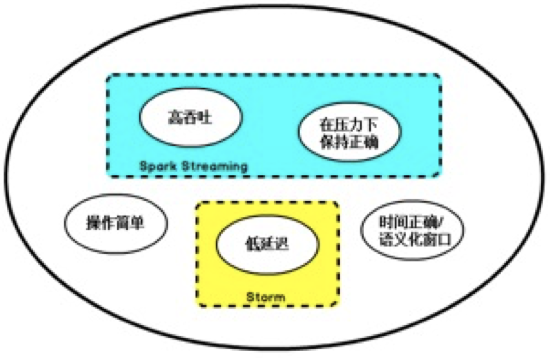
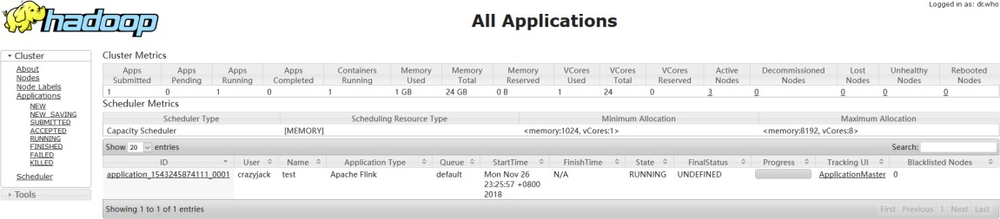
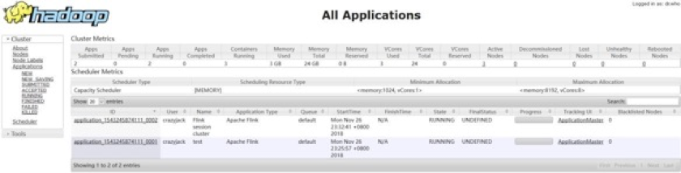

​			 				 	

## 1.1    流处理技术的演变

 

##### 在开源世界里，Apache Storm 项目是流处理的先锋。Storm 最早由 Nathan Marz

和创业公司 BackType 的一个团队开发，后来才被 Apache 基金会接纳。Storm 提供了低延迟的流处理，但是它为实时性付出了一些代价： **很难实现高吞吐**，并且其正确性没能达到通常所需的水平，换句话说，它**并不能保证** **exactly-once**，即便是它能

够保证的正确性级别，其开销也相当大。


在低延迟和高吞吐的流处理系统中维持良好的容错性是非常困难的， 但是为了得到有保障的准确状态，人们想到了一种替代方法： **将连续时间中的流数据分割成一系列微小的批量作业**。如果分割得足够小（ 即所谓的微批处理作业），计算就几乎可以实现真正的流处理。因为存在延迟， 所以不可能做到完全实时， 但是每个简单的应用程序都可以实现仅有几秒甚至几亚秒的延迟。这就是在 Spark 批处理引擎上运行的 Spark Streaming 所使用的方法。

更重要的是，使用==微批处理方法，可以实现 exactly-once 语义==，从而保障状态的一致性。如果一个微批处理失败了，它可以重新运行，这比连续的流处理方法更容易。**Storm** **Trident** **是对** **Storm** **的延伸，它的底层流处理引擎就是基于微批处理方**

**法来进行计算的， 从而实现了** **exactly-once** **语义， 但是在延迟性方面付出了很大的代价**。

对于 Storm Trident 以及 Spark Streaming 等微批处理策略，只能根据批量作业时间的倍数进行分割， 无法根据实际情况分割事件数据， 并且， 对于一些对延迟比较敏感的作业，往往需要开发者在写业务代码时花费大量精力来提升性能。这些灵活性和表现力方面的缺陷，使得这些微批处理策略开发速度变慢，运维成本变高。

于是，Flink 出现了，这一技术框架可以避免上述弊端，并且拥有所需的诸多功能，还能按照连续事件高效地处理数据， Flink 的部分特性如下图所示




## 1.2    **初识** **Flink**

Flink 起源于 Stratosphere 项目，Stratosphere 是在 2010~2014 年由 3 所地处柏林的大学和欧洲的一些其他的大学共同进行的研究项目， 2014 年 4 月 Stratosphere 的代码被复制并捐赠给了 Apache 软件基金会， 参加这个孵化项目的初始成员是Stratosphere 系统的核心开发人员， 2014 年 12 月， Flink 一跃成为 Apache 软件基金会的顶级项目。

 

|      |                                           |      |                                           |
| ---- | ----------------------------------------- | ---- | ----------------------------------------- |
|      |  |      |  |
|      |                                           |      |                                           |


在德语中，Flink 一词表示快速和灵巧，项目采用一只松鼠的彩色图案作为 logo，这不仅是因为松鼠具有快速和灵巧的特点，还因为柏林的松鼠有一种迷人的红棕色， 而 Flink 的松鼠 logo 拥有可爱的尾巴，尾巴的颜色与 Apache 软件基金会的 logo 颜色相呼应，也就是说，这是一只 Apache 风格的松鼠。


图 Flink Logo

Flink 主页在其顶部展示了该项目的理念：“ **Apache Flink** **是为分布式、高性能、随时可用以及准确的流处理应用程序打造的开源流处理框架”。

##### Apache Flink 是一个框架和分布式处理引擎，用于对无界和有界数据流进行有状态计算。Flink 被设计在所有常见的集群环境中运行，以内存执行速度和任意规模来执行计算。


## 1.3   **Flink** **核心计算框架**


6. Flink 默认页面

```shell
http://10.211.55.4:8081/#/overview
```


7. 命令执行程序

   ```shell
   # 执行实时流job
   ./bin/flink run -c [包+类名] -p [并行度] [jar包+执行参数] --【服务器上或者本地地址位置】
   
   ./bin/flink run -c com.liu.wc.StreamingWordCount -p 3 /home/bigdata/flink-1.10.1/FlinkTutorial-1.0-SNAPSHOT-jar-with-dependencies.jar --host localhost --port 7777
   
   
   # 取消实时流job
   # Job has been submitted with JobID 7bccf475736d939da360505e52e431f6
   
   ./bin/flink cancel 7bccf475736d939da360505e52e431f6
   
   # Cancelled job 7bccf475736d939da360505e52e431f6.
   
   #把当前所有的的job给列举出来
   ./bin/flink list
   
   #把当前被取消的job给列举出来
   ./bin/flink list -a
   
   [bigdata@bigdata flink-1.10.1]$ ./bin/flink list -a
   Waiting for response...
   No running jobs.
   No scheduled jobs.
   ---------------------- Terminated Jobs -----------------------
   18.05.2021 13:31:34 : 63b027649ed1c3e3c41de02f8043e5a5 : Flink Streaming Job (CANCELED)
   18.05.2021 13:57:10 : 7bccf475736d939da360505e52e431f6 : Flink Streaming Job (CANCELED)
   --------------------------------------------------------------
   
   
   
   ```

   

7. 在 hadoop-senior01 节点提交 Yarn-Session ， 使用安装目录下 bin 目录中的

yarn-session.sh 脚本进行提交：

```shell
/opt/modules/flink-1.6.1/bin/yarn-session.sh -n 2 -s 6 -jm 1024 -tm 1024 -nm test -d  
```

##### 其中： 

**-n(--container)**： TaskManager 的数量。==现在 没什么用了，现在session模式他不直接指定当前集群的taskmanager数量==

 **-s(--slots)**： 每个 TaskManager 的 slot 数量，默认一个 slot 一个 core，默认每个taskmanager 的 slot 的个数为 1。

**-jm**： JobManager 的内存（ 单位 MB)。

**-tm**： 每个 taskmanager 的内存（单位 MB)。

**-nm**： yarn 的 appName(现在 yarn 的 ui 上的名字)。

**-d**： 后台执行。


==Per Pob Cluster==

**不启动，yarn-session**，直接执行job

```shell
./flink run -m yarn-cluster -c com.liu.wc.StreamingWordCount /home/bigdata/flink-1.10.1/FlinkTutorial-1.0-SNAPSHOT-jar-with-dependencies.jar --host localhost --port 7777
```


##### 8.    启动后查看 Yarn 的 Web 页面， 可以看到刚才提交的会话：

 

|      |                                                   |
| ---- | ------------------------------------------------- |
|      |  |


9. 在提交 Session 的节点查看进程：


10. 提交 Jar 到集群运行：

/opt/modules/flink-1.6.1/bin/flink run -m yarn-cluster examples/batch/WordCount.jar  

##### 11.  提交后在 Yarn 的 Web 页面查看任务运行情况：



12. 任务运行结束后在控制台打印如下输出：

 

 

