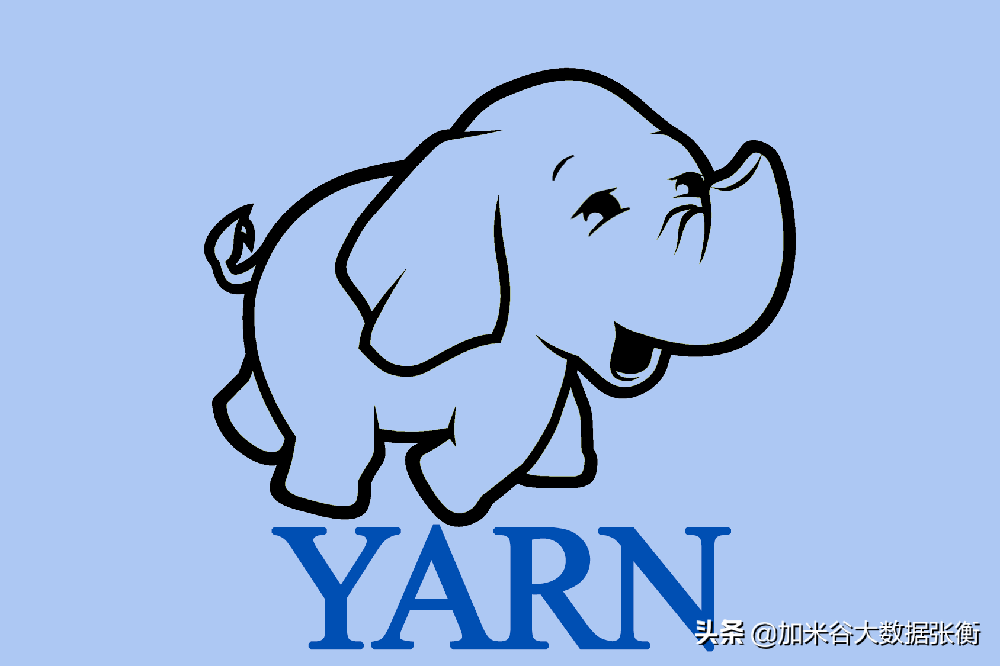
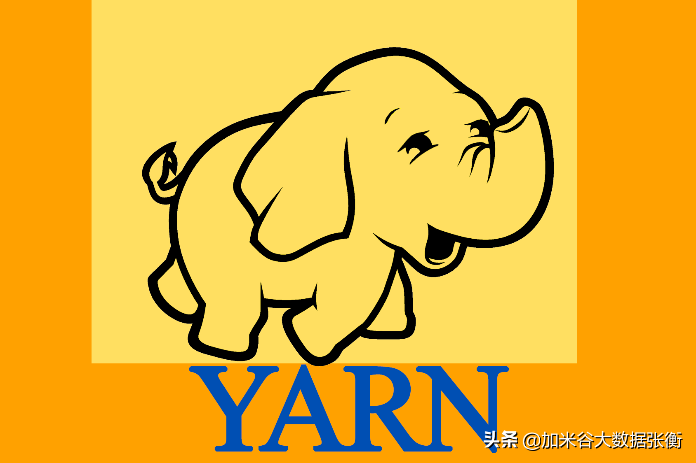

**一、什么是Yarn？**

从业界使用分布式系统的变化趋势和Hadoop框架的长远来看，MapReduce的JobTracker和TaskTracker机制需要大规模的调整来修复它在可扩展性、内存消耗、可靠性和性能上的缺陷。

为了从跟根本上解决上述问题，从Hadoop0.23.0版本开始，MapReduce框架完全重构，并把新的框架命名为YARN。

核心思想：将MP1中JobTracker的资源管理和作业调度两个功能分开，分别由ResourceManager和ApplicationMaster进程来实现。

1.ResourceManager：负责整个集群的资源管理和调度。

2.ApplicationMaster：负责应用程序相关的事务，比如任务调度、任务监控和容错等。

YARN的出现，使得多个计算框架可以运行在一个集群当中。

1.每个应用程序对应一个ApplicationMaster。

2.目前可以支持多种计算框架运行在YARN上面比如MapReduce、Storm、Spark、Flink等。

**大家还是好奇我们学习Yarn的原因，为什么都有了那么多框架了还要学Yarn？**

**二、MapReduce的不足之处**

1.JobTracker单点故障问题；如果Hadoop集群的JobTracker挂掉，则整个分布式集群都不能使用了。

2.JobTracker承受的访问压力大，影响系统的扩展性。

3.不支持MapReduce之外的计算框架，比如Storm、Spark、Flink等。

**三、Yarn的优秀之处**

1.Hadoop2.0提出了HDFSFederation；它让多个NameNode分管不同的目录进而实现访问隔离和横向扩展。对于运行中NameNode的单点故障，通过 NameNode热备方案（NameNode HA）实现 。

\2. YARN通过将资源管理和应用程序管理两部分剥离开来，分别由ResourceManager和ApplicationMaster进程来实现。其中，ResouceManager专管资源管理和调度，而ApplicationMaster则负责与具体应用程序相关的任务切分、任务调度和容错等。

3.YARN具有向后兼容性，用户在MR1上运行的作业，无需任何修改即可运行在YARN之上。

4.对于资源的表示以内存为单位（在目前版本的 Yarn 中没有考虑 CPU的占用），比之前以剩余 slot 数目为单位更合理。

5.支持多个框架，YARN不再是一个单纯的计算框架，而是一个框架管理器，用户可以将各种各样的计算框架移植到YARN之上，由YARN进行统一管理和资源分配，由于将现有框架移植到YARN之上需要一定的工作量，当前YARN仅可运行MapReduce这种离线计算框架。

6.框架升级容易，在YARN中，各种计算框架不再是作为一个服务部署到集群的各个节点上（比如MapReduce框架，不再需要部署JobTracker、 TaskTracker等服务），而是被封装成一个用户程序库（lib）存放在客户端，当需要对计算框架进行升级时，只需升级用户程序库即可。

以前MapReduce的不足之处都让现在的Yarn弥补了，并且还带了新的优点，这怎能让人忽视它的功能性？