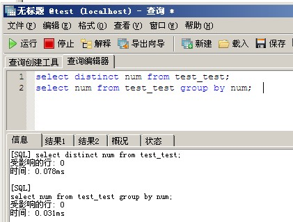
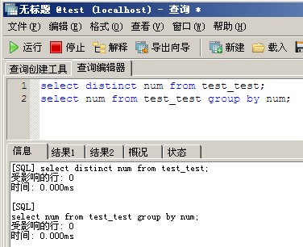
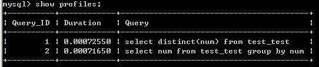

# [MySQL中distinct和group by性能比较](https://www.cnblogs.com/zox2011/archive/2012/09/12/2681797.html)

### MySQL中distinct和group by性能比较[转]

之前看了网上的一些测试，感觉不是很准确，今天亲自测试了一番。得出了结论(仅在个人计算机上测试，可能不全面，仅供参考)

测试过程：

准备一张测试表 

```
1    CREATE TABLE `test_test` (
2      `id` int(11) NOT NULL auto_increment,
3      `num` int(11) NOT NULL default '0',
4      PRIMARY KEY  (`id`)
5     ) ENGINE=MyISAM  DEFAULT CHARSET=utf8 AUTO_INCREMENT=1 ;
```

建个储存过程向表中插入10W条数据 

[](javascript:void(0);)

```
01    create procedure p_test(pa int(11)) 
02     begin 
03       
04      declare max_num int(11) default 100000; 
05      declare i int default 0; 
06      declare rand_num int; 
07       
08      select count(id) into max_num from test_test; 
09       
10      while i < pa do 
11              if max_num < 100000 then 
12                      select cast(rand()*100 as unsigned) into rand_num; 
13                      insert into test_test(num)values(rand_num); 
14              end if; 
15              set i = i +1; 
16      end while; 
17     end
```

[](javascript:void(0);)

调用存储过程插入数据

```
1    call p_test(100000);
```

**开始测试：（不加索引）**

[](javascript:void(0);)

```
01    select distinct num from test_test; 
02    select num from test_test group by num; 
03     
04    [SQL] select distinct num from test_test;
05    受影响的行: 0
06    时间: 0.078ms
07     
08    [SQL]  
09    select num from test_test group by num;
10    受影响的行: 0
11    时间: 0.031ms
```

[](javascript:void(0);)



二、num字段上创建索引

 

```
1    ALTER TABLE `test_test` ADD INDEX `num_index` (`num`) ;
```

 

再次查询

[](javascript:void(0);)

```
01    select distinct num from test_test; 
02    select num from test_test group by num; 
03    [SQL] select distinct num from test_test;
04    受影响的行: 0
05    时间: 0.000ms
06     
07    [SQL]  
08    select num from test_test group by num;
09    受影响的行: 0
10    时间: 0.000ms
```

[](javascript:void(0);)



这时候我们发现时间太小了 0.000秒都无法精确了。

 

我们转到命令行下 测试

[](javascript:void(0);)

```
01    mysql> set profiling=1;
02    mysql> select distinct(num) from test_test; 
03    mysql> select num from test_test group by num;
04    mysql> show profiles;
05    +----------+------------+----------------------------------------+
06    | Query_ID | Duration   | Query                                  |
07    +----------+------------+----------------------------------------+
08    |        1 | 0.00072550 | select distinct(num) from test_test    |
09    |        2 | 0.00071650 | select num from test_test group by num |
10    +----------+------------+----------------------------------------+
```

[](javascript:void(0);)



 

**加了索引之后 distinct 比没加索引的 distinct 快了 107倍。**

 

加了索引之后 group by 比没加索引的 group by 快了 43倍。

 

再来对比 ：distinct 和 group by

 

不管是加不加索引 group by 都比 distinct 快。因此使用的时候建议选 group by