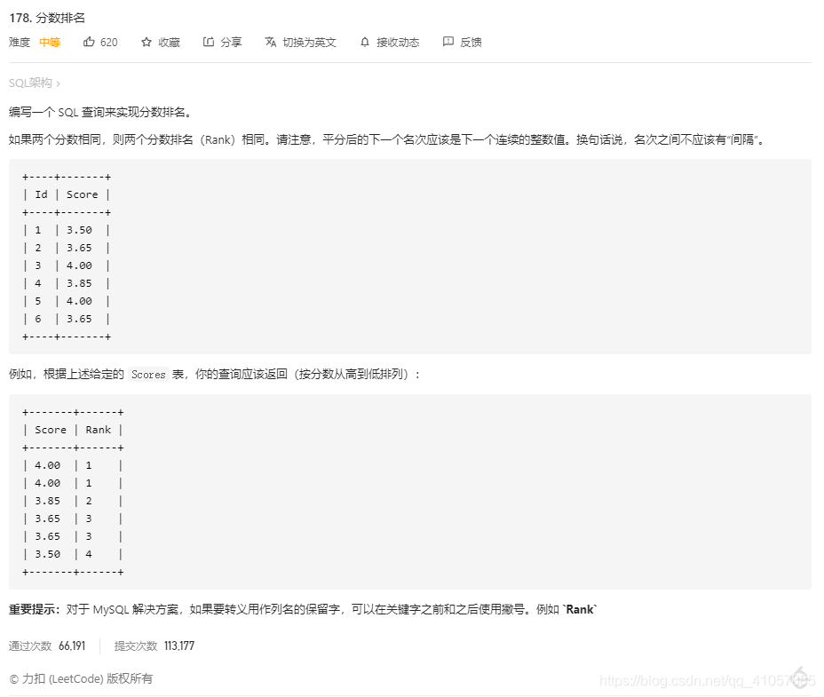
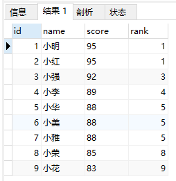
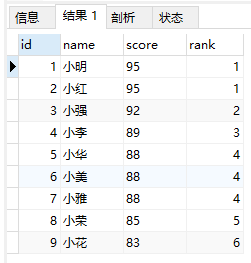
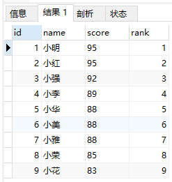

# 前言

**本篇介绍的三个函数均MySQL 8.x 以上版本，8.x以下版本会报语法错误，属于正常现象。**

**MySQL 8.x 实际上就是 MySQL 5.8x，大概是为了通过更大版本型号数字，证明自己比友商先进吧。**

**你可以通过 mysql --version （cmd命令）或者 select version() （sql语句）查看MySQL版本型号。**

------------------------------------------------


上述的这道题，如果不使用本次用到的函数的答案如下，也就是说，如果你的MySQL无法使用本篇中的函数，可以通过下面的语法逻辑做替换。

```sql
SELECT t1.Score as Score, 
( SELECT COUNT(DISTINCT t2.Score) FROM Scores t2 WHERE t2.Score >= t1.Score ) AS `Rank` 
FROM Scores t1 ORDER BY t1.Score DESC 
```

### rank() over(业务逻辑)

> 作用：查出指定条件后的进行排名，条件相同排名相同，排名间断不连续。
>
> 说明：例如学生排名，使用这个函数，成绩相同的两名是并列，下一位同学空出所占的名次。即：1 1 3 4 5 5 7

```sql
SELECT id, name, score, rank() over(ORDER BY score DESC) AS 'rank' FROM student 
```



### dense_rank() over(业务逻辑)

作用：查出指定条件后的进行排名，条件相同排名相同，排名间断不连续。

说明：和rank() over 的作用相同，区别在于dense_rank() over 排名是密集连续的。例如学生排名，使用这个函数，成绩相同的两名是并列，下一位同学接着下一个名次。即：1 1 2 3 4 5 5 6


```sql
SELECT id, name, score, dense_rank() over(ORDER BY score DESC) AS 'rank' FROM student 
```


------------------------------------------------


### row_number() over(业务逻辑)

作用：查出指定条件后的进行排名，条件相同排名也不相同，排名间断不连续。

说明：这个函数不需要考虑是否并列，即使根据条件查询出来的数值相同也会进行连续排序。即：1 2 3 4 5 6

```sql
SELECT id, name, score, row_number() over(ORDER BY score DESC) AS 'rank' FROM student 
```



### 后记

函数中的业务逻辑可以是复杂的，不局限于 ORDER BY，也可以加 PARTITION BY。

### 分班级排名

```sql
SELECT id, name, score, class, row_number() over(PARTITION BY class ORDER BY score DESC) AS 'rank' 
FROM student 
```

