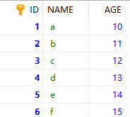
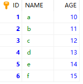
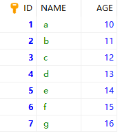
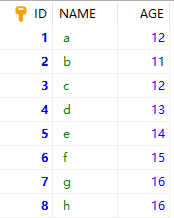
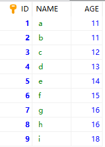

# Mysql 插入数据

## 1、插入数据方法

mysql中常用的三种插入数据的语句:

- insert into：正常的插入数据，插入数据的时候会检查主键或者唯一索引，如果出现重复就会报错；
- replace into：表示插入并替换数据，若表中有primary key或者unique索引，在插入数据的时候，若遇到重复的数据，则用新数据替换，如果没有数据效果则和insert into一样；
- insert ignore into：插入并忽略数据，如果中已经存在相同的记录，则忽略当前新数据。这样不用校验是否存在了，有则忽略，无则添加

------------------------------------------------
## 2、语法介绍

### 2.1 insert into

每个字段与其值是严格一一对应的。也就是说：每个值、值的顺序、值的类型必须与对应的字段相匹配。但是，各字段也无须与其在表中定义的顺序一致，它们只要与 VALUES中值的顺序一致即可。

语法如下：

```sql
# 表中有些字段有默认值，则可以直接根据字段插入数据
INSERT INTO 表名（字段名1,字段名2,...) VALUES (值 1,值 2,...);

# 按照表中所有字段进行插入数据，一定要与字段在表中定义的顺序一致
INSERT INTO 表名 VALUES (值 1,值 2,...);

```

### 2.2 insert ignore into

这种方式的语法跟insert into 是一样的，只不过在遇到重复的数据时做出的处理不一致，有重复的就忽略该条数据的插入

语法如下：

```sql
# 表中有些字段有默认值，则可以直接根据字段插入数据
INSERT IGNORE INTO 表名（字段名1,字段名2,...) VALUES (值 1,值 2,...);

# 按照表中所有字段进行插入数据，一定要与字段在表中定义的顺序一致
INSERT IGNORE INTO 表名 VALUES (值 1,值 2,...);

```

题外：

MySQL 自4.1版以后开始支持INSERT … ON DUPLICATE KEY UPDATE语法，对于插入数据时候遇到重复的primary key 时候，可以进行数据的更新，就避免了insert ignore into遇到重复的数据直接忽略的不足。但是一定要保证使用的时候是想要更新重复数据哦，不然就尴尬啦~~

```sql
INSERT … ON DUPLICATE KEY UPDATE

```

### 2.3 replace into

## 3、使用示例

初始表准备：

创建一个study 表， id 是自增主键

```sql
CREATE TABLE study(
	ID INT NOT NULL PRIMARY KEY AUTO_INCREMENT ,
	NAME VARCHAR(20) NOT NULL,
	AGE INT(10)
);

```

首先插入一些为方便测试的数据：

```sql
INSERT INTO study VALUES(1 , 'a' , 10);
INSERT INTO study VALUES(2 , 'b' , 11);
INSERT INTO study VALUES(3 , 'c' , 12);
INSERT INTO study VALUES(4 , 'd' , 13);
INSERT INTO study VALUES(5 , 'e' , 14);
INSERT INTO study VALUES(6 , 'f' , 15);

```

此时查询：

```sql
select * from study

```



开始测试：

**（一）测试insert into**

例如，现在再插入id 为 1 的数据与id为7的数据

```sql
INSERT INTO study VALUES(1 , 'a' , 11);
INSERT INTO study VALUES(7 , 'g' , 16);

```

结果：

```sql
INSERT INTO study VALUES(1 , 'a' , 11);
/* SQL错误（1062）：Duplicate entry '1' for key 'PRIMARY' */
/* 受影响记录行数: 0  已找到记录行: 0  警告: 0  持续时间 0 的 2 条查询: 0.000 秒. */

```

报错。此时表中的数据：**id 为 7的数据是没有插入成功的**




**（二）测试insert ignore into**

例如，做同样的事情，现在再插入id 为 1 的数据与id为7的数据

```sql
INSERT INTO study VALUES(1 , 'a' , 11);
INSERT INTO study VALUES(7 , 'g' , 16);

```

结果：

```sql
INSERT IGNORE INTO study VALUES(1 , 'a' , 11);
INSERT IGNORE INTO study VALUES(7 , 'g' , 16);
/* 受影响记录行数: 1  已找到记录行: 0  警告: 1  持续时间 3 条查询: 0.062 秒. */
SHOW WARNINGS LIMIT 5;

```

插入成功。此时表中的数据：**id 为 7的数据是插入成功，而id为1的数据也并没有更新**



**（三）测试 INSERT … ON DUPLICATE KEY UPDATE**

例如，做同样的事情，现在再插入id 为 1 的数据与id为8的数据

```sql
INSERT INTO study VALUES(1 , 'a' , 11) ON DUPLICATE KEY UPDATE age = 12;
INSERT INTO study VALUES(8 , 'h' , 16) ON DUPLICATE KEY UPDATE age = 13;

```

结果：

```sql
INSERT INTO study VALUES(1 , 'a' , 11) ON DUPLICATE KEY UPDATE age = 12;
INSERT INTO study VALUES(8 , 'h' , 16) ON DUPLICATE KEY UPDATE age = 13;
/* 受影响记录行数: 3  已找到记录行: 0  警告: 0  持续时间 2 条查询: 0.015 秒. */

```

插入成功。此时表中的数据：**id 为 1 的 因为存在所以数据被更新了，而id为8 之前并没有，所以其数据也并没有更新**



**（四）测试 replace into**

经过上面的操作，目前的表数据由上图所示。

例如，做同样的事情，现在再插入id 为 1 的数据与id为9的数据。

```sql
REPLACE INTO study VALUES(1 , 'a' , 11);
REPLACE INTO study VALUES(9 , 'i' , 18);

```

结果：

```sql
REPLACE INTO study VALUES(1 , 'a' , 11);
REPLACE INTO study VALUES(9 , 'i' , 18);
/* 受影响记录行数: 3  已找到记录行: 0  警告: 0  持续时间 3 条查询: 0.000 秒. */

```

插入成功。此时表中的数据：**id 为 1 的 因为存在所以数据被更新为了11，而id为9 之前并没有，所以其数据也并没有更新**



**注意的是：插入数据的表必须有主键或者是唯一索引！否则的话，replace into 会直接插入数据，这将导致表中出现重复的数据。**

