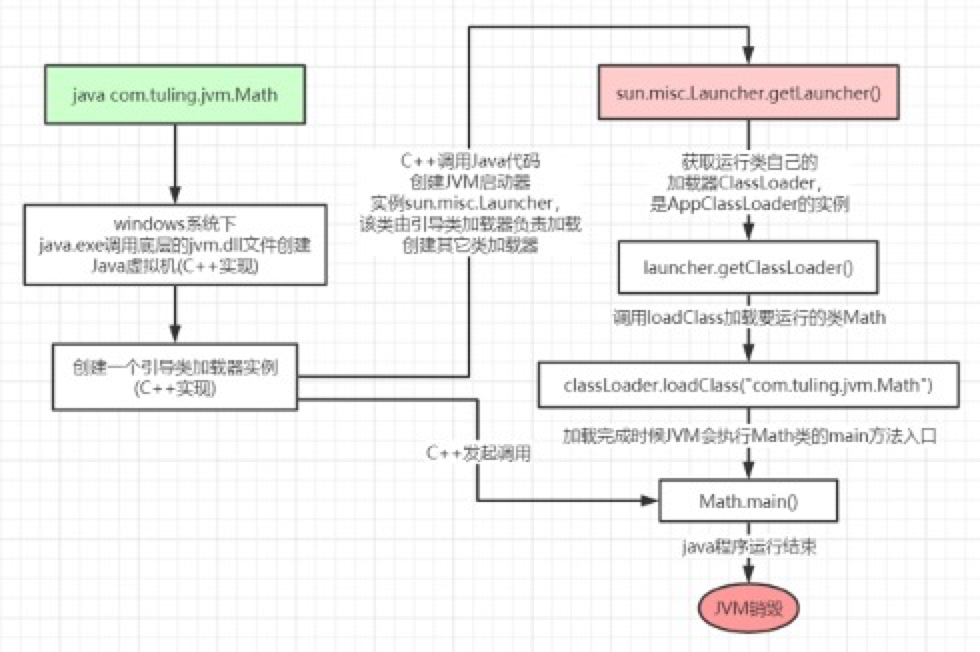

### 1. 类加载运行全过程 

当我们用java命令运行某个类的main函数启动程序时，首先需要通过类加载器把主类加载到 JVM。

```java
packagecom.tuling.jvm;
publicclassMath{
public static final int initData = 666; public static User user = new User();
public int compute() { //一个方法对应一块栈帧内存区域 inta=1;
intb=2;
intc=(a+b)*10; return c;
}
  public static void main(String[] args) {
  Math math = new Math();
  math.compute();
  }
}
```

通过Java命令执行代码的大体流程如下:



