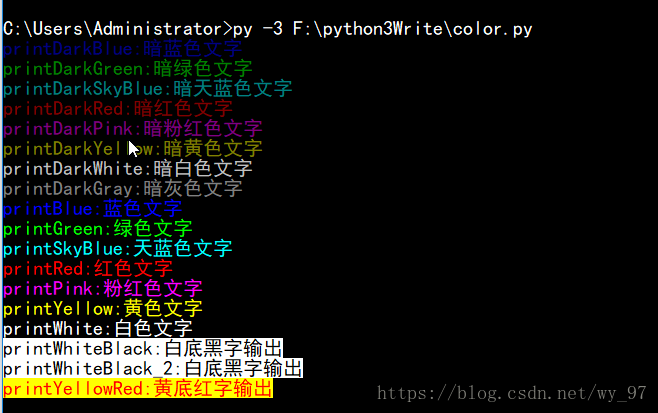

# Python3改变cmd（命令行）输出颜色


用`Python`写命令行程序的时候，单一的输出颜色太单调。其实我们可以加些色彩，比如用红色表示警告，绿色表示结果正常等。这里，对`Windows`下`CMD`输出彩色进行完整的讲解和易用的代码函数库展示。

先上效果图:



```python
import ctypes,sys

STD_INPUT_HANDLE = -10
STD_OUTPUT_HANDLE = -11
STD_ERROR_HANDLE = -12

# 字体颜色定义 ,关键在于颜色编码，由2位十六进制组成，分别取0~f，前一位指的是背景色，后一位指的是字体色
#由于该函数的限制，应该是只有这16种，可以前景色与背景色组合。也可以几种颜色通过或运算组合，组合后还是在这16种颜色中

# Windows CMD命令行 字体颜色定义 text colors
FOREGROUND_BLACK = 0x00 # black.
FOREGROUND_DARKBLUE = 0x01 # d
ark blue.
FOREGROUND_DARKGREEN = 0x02 # dark green.
FOREGROUND_DARKSKYBLUE = 0x03 # dark skyblue.
FOREGROUND_DARKRED = 0x04 # dark red.
FOREGROUND_DARKPINK = 0x05 # dark pink.
FOREGROUND_DARKYELLOW = 0x06 # dark yellow.
FOREGROUND_DARKWHITE = 0x07 # dark white.
FOREGROUND_DARKGRAY = 0x08 # dark gray.
FOREGROUND_BLUE = 0x09 # blue.
FOREGROUND_GREEN = 0x0a # green.
FOREGROUND_SKYBLUE = 0x0b # skyblue.
FOREGROUND_RED = 0x0c # red.
FOREGROUND_PINK = 0x0d # pink.
FOREGROUND_YELLOW = 0x0e # yellow.
FOREGROUND_WHITE = 0x0f # white.


# Windows CMD命令行 背景颜色定义 background colors
BACKGROUND_BLUE = 0x10 # dark blue.
BACKGROUND_GREEN = 0x20 # dark green.
BACKGROUND_DARKSKYBLUE = 0x30 # dark skyblue.
BACKGROUND_DARKRED = 0x40 # dark red.
BACKGROUND_DARKPINK = 0x50 # dark pink.
BACKGROUND_DARKYELLOW = 0x60 # dark yellow.
BACKGROUND_DARKWHITE = 0x70 # dark white.
BACKGROUND_DARKGRAY = 0x80 # dark gray.
BACKGROUND_BLUE = 0x90 # blue.
BACKGROUND_GREEN = 0xa0 # green.
BACKGROUND_SKYBLUE = 0xb0 # skyblue.
BACKGROUND_RED = 0xc0 # red.
BACKGROUND_PINK = 0xd0 # pink.
BACKGROUND_YELLOW = 0xe0 # yellow.
BACKGROUND_WHITE = 0xf0 # white.


# get handle
std_out_handle = ctypes.windll.kernel32.GetStdHandle(STD_OUTPUT_HANDLE)

def set_cmd_text_color(color, handle=std_out_handle):
    Bool = ctypes.windll.kernel32.SetConsoleTextAttribute(handle, color)
    return Bool

#reset white
def resetColor():
    set_cmd_text_color(FOREGROUND_RED | FOREGROUND_GREEN | FOREGROUND_BLUE)

###############################################################

#暗蓝色
#dark blue
def printDarkBlue(mess):
    set_cmd_text_color(FOREGROUND_DARKBLUE)
    sys.stdout.write(mess)
    resetColor()

#暗绿色
#dark green
def printDarkGreen(mess):
    set_cmd_text_color(FOREGROUND_DARKGREEN)
    sys.stdout.write(mess)
    resetColor()

#暗天蓝色
#dark sky blue
def printDarkSkyBlue(mess):
    set_cmd_text_color(FOREGROUND_DARKSKYBLUE)
    sys.stdout.write(mess)
    resetColor()

#暗红色
#dark red
def printDarkRed(mess):
    set_cmd_text_color(FOREGROUND_DARKRED)
    sys.stdout.write(mess)
    resetColor()

#暗粉红色
#dark pink
def printDarkPink(mess):
    set_cmd_text_color(FOREGROUND_DARKPINK)
    sys.stdout.write(mess)
    resetColor()

#暗黄色
#dark yellow
def printDarkYellow(mess):
    set_cmd_text_color(FOREGROUND_DARKYELLOW)
    sys.stdout.write(mess)
    resetColor()

#暗白色
#dark white
def printDarkWhite(mess):
    set_cmd_text_color(FOREGROUND_DARKWHITE)
    sys.stdout.write(mess)
    resetColor()

#暗灰色
#dark gray
def printDarkGray(mess):
    set_cmd_text_color(FOREGROUND_DARKGRAY)
    sys.stdout.write(mess)
    resetColor()

#蓝色
#blue
def printBlue(mess):
    set_cmd_text_color(FOREGROUND_BLUE)
    sys.stdout.write(mess)
    resetColor()

#绿色
#green
def printGreen(mess):
    set_cmd_text_color(FOREGROUND_GREEN)
    sys.stdout.write(mess)
    resetColor()

#天蓝色
#sky blue
def printSkyBlue(mess):
    set_cmd_text_color(FOREGROUND_SKYBLUE)
    sys.stdout.write(mess)
    resetColor()

#红色
#red
def printRed(mess):
    set_cmd_text_color(FOREGROUND_RED)
    sys.stdout.write(mess)
    resetColor()

#粉红色
#pink
def printPink(mess):
    set_cmd_text_color(FOREGROUND_PINK)
    sys.stdout.write(mess)
    resetColor()

#黄色
#yellow
def printYellow(mess):
    set_cmd_text_color(FOREGROUND_YELLOW)
    sys.stdout.write(mess)
    resetColor()

#白色
#white
def printWhite(mess):
    set_cmd_text_color(FOREGROUND_WHITE)
    sys.stdout.write(mess)
    resetColor()

##################################################

#白底黑字
#white bkground and black text
def printWhiteBlack(mess):
    set_cmd_text_color(FOREGROUND_BLACK | BACKGROUND_WHITE)
    sys.stdout.write(mess)
    resetColor()

#白底黑字
#white bkground and black text
def printWhiteBlack_2(mess):
    set_cmd_text_color(0xf0)
    sys.stdout.write(mess)
    resetColor()


#黄底蓝字
#white bkground and black text
def printYellowRed(mess):
    set_cmd_text_color(BACKGROUND_YELLOW | FOREGROUND_RED)
    sys.stdout.write(mess)
    resetColor()


##############################################################

if __name__ == '__main__':
    
    print
    printDarkBlue(u'printDarkBlue:暗蓝色文字\n')
    printDarkGreen(u'printDarkGreen:暗绿色文字\n')
    printDarkSkyBlue(u'printDarkSkyBlue:暗天蓝色文字\n')
    printDarkRed(u'printDarkRed:暗红色文字\n')
    printDarkPink(u'printDarkPink:暗粉红色文字\n')
    printDarkYellow(u'printDarkYellow:暗黄色文字\n')
    printDarkWhite(u'printDarkWhite:暗白色文字\n')
    printDarkGray(u'printDarkGray:暗灰色文字\n')
    printBlue(u'printBlue:蓝色文字\n')
    printGreen(u'printGreen:绿色文字\n')
    printSkyBlue(u'printSkyBlue:天蓝色文字\n')
    printRed(u'printRed:红色文字\n')
    printPink(u'printPink:粉红色文字\n')
    printYellow(u'printYellow:黄色文字\n')
    printWhite(u'printWhite:白色文字\n')
    printWhiteBlack(u'printWhiteBlack:白底黑字输出\n')
    printWhiteBlack_2(u'printWhiteBlack_2:白底黑字输出\n')
    printYellowRed(u'printYellowRed:黄底红字输出\n')

```

