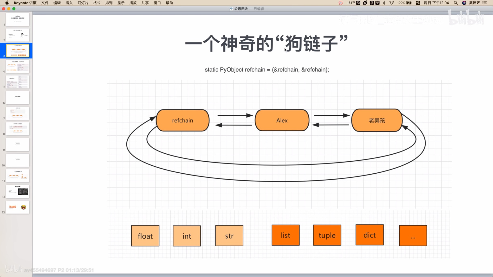
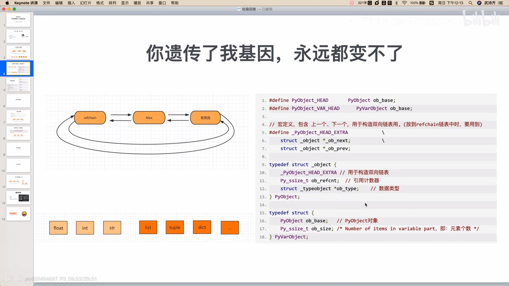
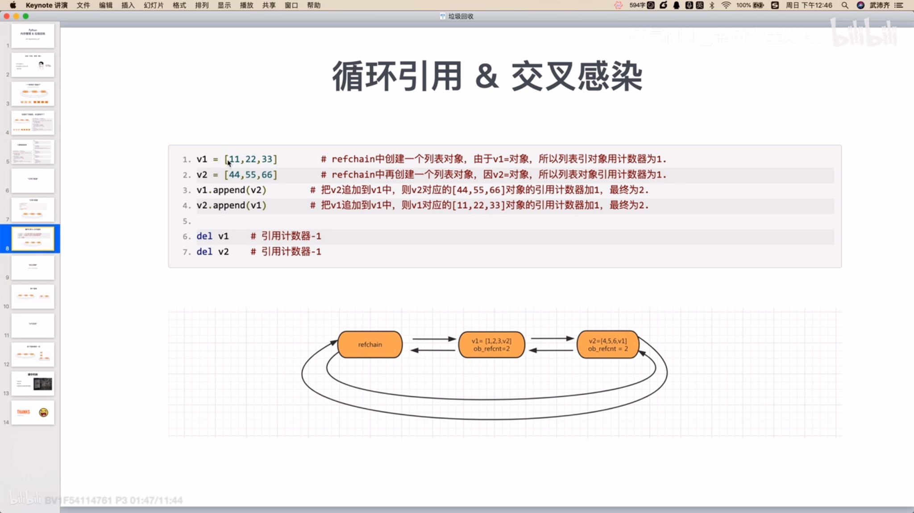
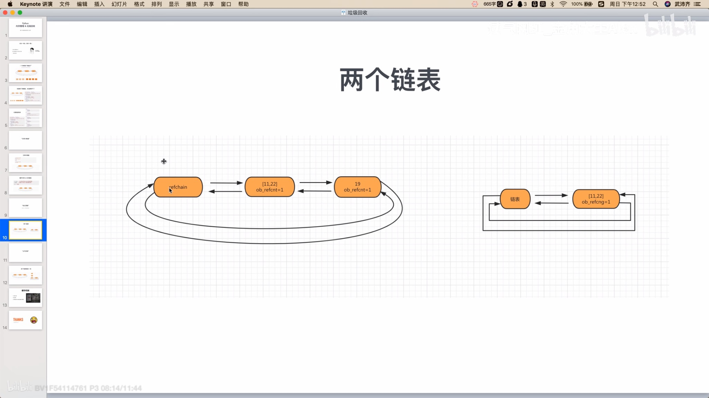
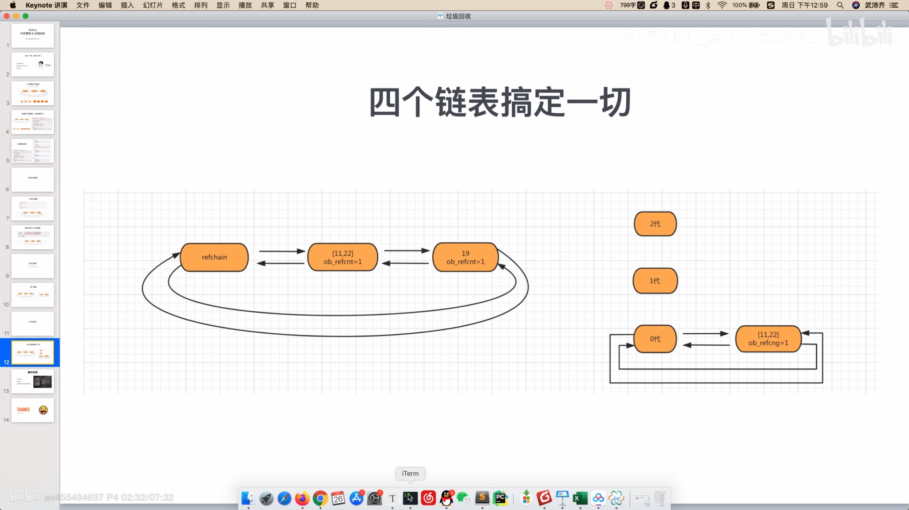

# **Python垃圾回收**

引用计数器为主

标记清除和分代回收为辅

+缓存机制

都是何种方式实现的啊？

------

基于**C语言源码**底层，真正了解垃圾回收的机制

- 引用计数器
- 标记清除
- 分代回收
- 缓存机制
- Python的C源码(3.8.3版本)

## 1.引用计数器

### 1.1 环状双向链表refchain

==在python程序中创建的任何对象都会放在refchain链表中。==

创建的不同的类型的变量，在双向链表中会有不同。他们会有相同点。



```python
#!/usr/bin/python3
# -*- encoding: utf-8 -*-
"""
name = “吴佩奇”
age = 18
hobby = ["篮球","美女"]
```

```
内部会创建一些数据【上一个对象，下一个对象，类型，引用的个数】，每一个对象内部都有这四个值
# name = “吴佩奇”
new = name # 定义一个新的对象也等于name，不会开辟新的内存地址，双向链表中引用个数为2

内部会创建一些数据【上一个对象，下一个对象，类型，引用的个数，val = 18】
age = 18

内部会创建一些数据【上一个对象，下一个对象，类型，引用的个数，items=元素，元素的个数】
hobby = ["篮球","美女"]

```



在C语言源码中如何体现每个对象中都有相同的值：PyObject结构体(4个值)。

每个多元素组成的对象：PyObject结构体(4个值) + ob_size。


python内部使用引用计数，来保持追踪内存中的对象，Python内部记录了对象有多少个引用，即引用计数，当对象被创建时就创建了一个引用计数，当对象不再需要时，这个对象的引用计数为0时，它被垃圾回收。


1. 打开冰箱
   1. 进口大象			
   2. 太贵了
2. 把大象放进冰箱
3. 关闭冰箱

### 1.2 类型封装结构体

```python
data = 3.14

内部会创建：
	_ob_next = refchain中的下一个对象
    _ob_prev = refchain中的上一个对象
    ob_refcnt = 1
    ob_type = float
    ob_fval = 3.14
```

### 1.3 引用计数器

```python
v1 = 3.14
v2 = 999
v3 = (1,2,3)
```

当python程序运行时，会根据数据类型的不同找到其对应的的结构体，根据结构体中的字段来进行创建相关的数据，然后将对象添加到refchain双向链表中。

在C源码中有两个关键的结构体：PyObject、PyVarObject

每个对象中都有ob_refcnt就是引用计数器，值默认为1，当有其他变量引用对象时，引用计数器就会发生变化。

- 引用

  ```python
  a = 9999
  b = a # 引用计数器=2
  ```

  

- 删除引用

  ```python
  a = 9999
  b = a
  del b # b 变量删除；b对应对象引用计数器-1
  del a # a 变量删除；a对应对象引用计数器-1
  
  # 当一个对象的引用计数器为0时，意味着没有人在使用那个这个对象了，这个对象就是垃圾了，垃圾回收。
  # 回收：1.对象从refchain 链表移除 2.将对象销毁，内存归还给操作系统。
  ```

  

### 1.4循环引用问题


## 2.标记清除

目的：为了解决引用计数器循环引用的不足。

实现：在python的底层再维护一个链表，链表中专门放那些可能存在的循环引用的对象(list/tuple/dict/set)



再python内部`某种情况`下触发，回去扫描可能存在循环应用的链表中的每个元素，检查是否有循环引用们，==如果有则让双方的引用计数器-1；==如果是0则垃圾回收。

问题：

- 什么时候扫描？
- 可能存在循环引用的链表扫描的代价？

## 3.分代回收




将可能存在循环应用的对象维护成3个链表：

- 0代：0代中==对象个数==达到700个扫描一次。
- 1代：0代扫描==10次==，则1代扫描一次。
- 2代：1代扫描==10次==，则1代扫描一次。

## 4.小结

再python中维护了一个refchain的双向环状链表，这个链表中存储程序所创建的对象，每种类型的对象都有一个ob_refcnt引用计数器的值，引用个数+1，-1，最后当引用个计数器变为0时会进行垃圾回收(对象的销毁、refchain中的移除)

但是，再python中对于那些可以有==多个元素组成的对象==可能会存在循环引用的问题，为了解决这个问题python又引入了==标记清除==和==分代回收==。在其内部维护4个链表。

- refchain-维护所有对象
- 0代-700个对象
- 1代-10次(0代)
- 2代-10次(1代)

在源码的内部当达到各自的阈值，就会触发扫描链表进行清除动作(有循环各自-1)。


But，在源码内部在上述流程提出了优化机制。

## 5.Python缓存机制

###  5.1池（int、字符串）

为了避免重复的创建和销毁一些常见对象，维护一个==池==。

```python
# python内部其中解析器的时候，帮我们创建-5,-4...256,先创建，提升Python的性能
v1 = 7 # 内部不会开辟内存，直接去池中获取
v2 = 9 # 内部不会开辟内存，直接去池中获取
v3 = 9 # 内部不会重新开辟内存，直接去池中获取，指向的内存的地址是一样的。
print(id(v2),id(v3))


v4 = 999 # 超过了256，不会从 池 中获取， 需要重新开辟内存地址
v5 = 666
v6 = 666
```

### 5.2 free_list（float/list/tuple/dict）

当一个对象的引用的计数器为0时，按理说应该垃圾回收，但是内部不会直接回收，而是将其对象添加到free_list链表中当缓存。以后再去创建对象时，

不会重新开辟内存，而是直接使用free_list。

```python
v1 = 3.14 # 开辟内存，内存存储结构体中定义的那几个值，并存在refchain中
del v1 # 引用的计数器为0，按理来说应该在refchain中移除并销毁，但是将这个对象添加到free_list中，有个数的限制，比如80个，free_list满了才会销毁。

v9 = 9999.99 # 不会重新开辟内存，在free_list中获取对象，对象内部数据初始化没在放到refchain中。

```

https://pythonav.com/wiki/detail/6/88/


