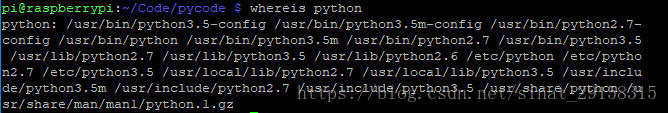
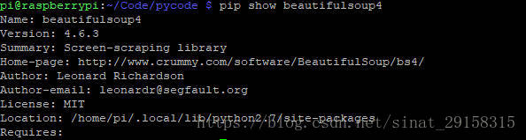

# 查看python安装路径及pip安装的包列表及路径

**一、Linux系统**

查看Python路径

```sh
whereis python
```

此命令将会列出系统所安装的所有版本的Python的路径效果如下： 



使用以下命令可分别查看Python2，Python3的安装路径

```sh
whereis python2whereis python3
```

**查看使用pip安装的软件包**

默认Python3

```sh
pip list
```

Python2查看pip安装的软件包名称及版本

```sh
python2 -m pip list
```

Python3查看pip安装的软件包及版本

```sh
python3 -m pip list
```

```sh
pip freeze
```

进行查看，安装包的路径。两者的具体区别详见：[pip list 和 pip freeze

**查看pip安装的软件包路径**

例如查看 beautifulsoup4的安装路径

```sh
pip show beautifulsoup4
```

效果如下： 



**二、Windows 环境**

**查看Python路径**

```sh
where python
```

查看使用pip安装的软件包

命令同Linux系统环境，若出现错误“不是内部或外部命令也不是可运行程序”请修改环境变量添加Python相应路径。


# 无网络环境安装python模块

```sh
#已安装的模块名称导出到文件
pip freeze >requirements.txt
 
 
#导出已安装的模块到文件夹，指定模块名称或导出所有已安装的模块
pip3 download  -d D:\python\pip\package  elasticsearch
pip3 download  -d D:\python\pip\package  -r requirements.txt
 
 
#在无网络的机器上安装已导出的模块，指定模块名称或指定包含所有模块列表的文件
pip install --no-index --find-links=D:\python\pip\package -r requirements
pip install --no-index --find-links=D:\python\pip\package elasticsearch
 
如发生错误Fatal error in launcher,用如下命令
python -m pip install --no-index --find-links=D:\python\pip\package elasticsearch
```

