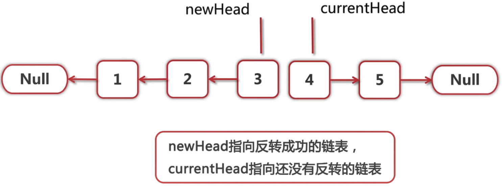
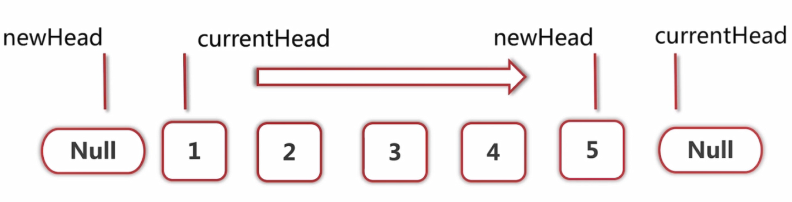
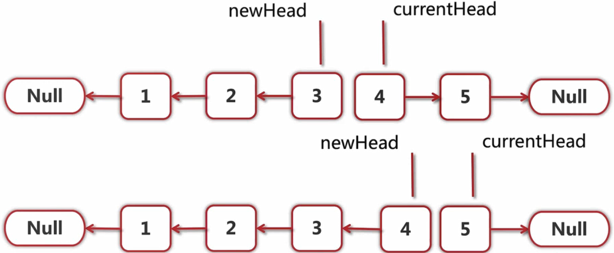

### 1.反转链表

输入一个链表，反转链表后，输出新链表的表头。

示例1

## 输入

[复制](javascript:void(0);)

```
{1,2,3}
```

## 返回值

[复制](javascript:void(0);)

```
{3,2,1}
```

说明：本题目包含复杂数据结构ListNode，[点此查看相关信息](https://blog.nowcoder.net/n/954373f213e14eeab0a69ed0e9ef1b6e)

主要的思想是用两个指针，其中`newHead`指向的是反转成功的链表的头部，`currentHead`指向的是还没有反转的链表的头部：



初始状态是`newHead`指向`null`，`currentHead`指向的是第一个元素，一直往后遍历直到`newHead`指向最后一个元素为止：



下面展示的是其中某个时间点的指向细节：




理解了上面的图示，程序就呼之欲出了。