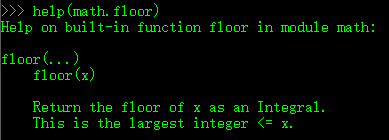
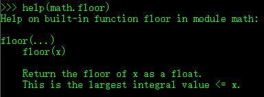

### 1. 当一个嵌套函数在其外部区域引用了一个值时，该嵌套函数就是一个闭包，以下代码输出值为：

```pytho
def adder(x):
    def wrapper(y):
        return x + y
    return wrapper
adder5 = adder(5)
print(adder5(adder5(6)))
```


```
10
12
14
16
```

闭包就是：

1.一个函数（外函数）内部定义了一个函数（内函数）

2.内函数调用了外函数的变量

3.并且外函数的返回值是内函数的引用

第一个adder5=adder（5）结束后，x=5，adder返回值为wrapper

adder5(6)，此时wrapper(6)，所以值为11，x为5

adder5(adder5(6))，同理，11+5=16

### 2.下述字符串格式化语法正确的是？

```python
'GNU's Not %d %%'  % 'UNIX'
'GNU\'s Not %d %%'  % 'UNIX'
'GNU's Not %s %%'   % 'UNIX'
'GNU\'s Not %s %%'  % 'UNIX'
```

python里面%d表数字，%s表示字符串，%%表示一个%；

单引号内嵌套单引号需要转义字符/;单引号内嵌套双引号不需要嵌套；

双引号内嵌套双引号需要转义字符/；双引号内引用单引号不需要转义字符；

### 3. 下列程序运行结果为：

```python
a=[1, 2, 3, 4, 5]
sums = sum(map(lambda x: x + 3, a[1::3]))
print(sums)

10
13
15
17
```

首先要说明的是，这是一段python代码，不搞python的可以绕过。

运行a[1::3]，从index=1开始，步幅为3，到一个新的数组b，b=[2,5]；

运行map(lambda x: x + 3, b)，数组b中每个元素加3，又得到一个新的数组c，c=[5,8]；

运行sums = sum(c)，求和得到sums=13；

因此选B。

### 4. 关于Python中的复数，下列说法错误的是

```
表示复数的语法是real + image j
实部和虚部都是浮点数
虚部必须后缀j，且必须是小写
方法conjugate返回复数的共轭复数
```

正确答案选 C。

选项 A：Python 中复数的表示方法；

选项 B：复数的实部与虚部均为浮点数；

选项 C：虚部的后缀可以是 “j” 或者 “J”；

选项 D：复数的 conjugate 方法可以返回该复数的共轭复数。

详情可参考官方文档：

> [Python2 Numeric Types](https://docs.python.org/2/library/stdtypes.html#numeric-types-int-float-long-complex)
>
> [Python3 Numeric Types](https://docs.python.org/3/library/stdtypes.html#numeric-types-int-float-complex)

### 5.Python调用(  )函数可实现对文件内容的读取

```
read()
readline()
readlines()
readclose()
```

1.read([size])方法从文件当前位置起读取size个字节，若无参数size，则表示读取至文件结束为止，它范围为字符串对象。 

2.readline()方法每次读出一行内容，所以，读取时占用内存小，比较适合大文件，该方法返回一个字符串对象。

3.readlines()方法读取整个文件所有行，保存在一个列表(list)变量中，每行作为一个元素，但读取大文件会比较占内存。

 https://www.cnblogs.com/yun1108/p/8967334.html

### 6. 关于return说法正确的是（   ）

```
python函数中必须有return
return可以返回多个值
return没有返回值时，函数自动返回Null
执行到return时，程序将停止函数内return后面的语句
```

C. return没有返回值时，函数自动返回None，Python没有Null

### 7.下列表达式的值为True的是

```
5+4j > 2-3j
3>2>2
(3,2)< ('a','b')
’abc’ > ‘xyz’
```

[
](https://www.nowcoder.com/profile/543695)[ciphersaw](https://www.nowcoder.com/profile/543695)

本题在 Python2 下答案选 C，在 Python3 下全部错误。

选项 A：Python2 与 Python3 均不支持复数比较大小，Python2 中会抛出以下错误：

> TypeError: no ordering relation is defined for complex numbers

Python3 中会抛出以下错误：

> TypeError: '>' not supported between instances of 'complex' and 'complex'

数字类型的比较可参考：

> [Python2 Numeric Types](https://docs.python.org/2/library/stdtypes.html#numeric-types-int-float-long-complex)
> [Python3 Numeric Types](https://docs.python.org/3/library/stdtypes.html#numeric-types-int-float-complex)

选项 B：Python2 与 Python3 均支持连续比较，相当于 3>2 and 2>2，后一个判断式为假，因此整个表达式都为假。可参考官方文档：

> [Python2 Comparisons](https://docs.python.org/2/library/stdtypes.html#comparisons)
> [Python3 Comparisons](https://docs.python.org/3/library/stdtypes.html#comparisons)

选项 C：Python2 支持数字与字符串之间的比较，而 Python3 则不支持，会报以下错误：

> TypeError: '>' not supported between instances of 'int' and 'str'

~~tuple 类型的比较是元素多的大于元素少的，若元素个数相等，则从第一个元素开始依次向后比较，直到两个元素不相等才结束。（字符串貌似永远比数字大，文档没找到说明，试出来的）~~
**-------- Update in 2018/03/24 感谢更正，不明白为何当时会出上面的结果。--------**
tuple 的比较是从两者的第一个元素的 ASCII 码开始，直至两个元素不相等为止，若前面元素都相等，则元素个数多的 tuple 较大。

```
(``1``,``9``) < (``2``,``3``) # True``(``8``,``9``) < (``1``,``2``,``3``) # False``(``1``,``2``,``3``) == (``1``,``2``,``3``) # True``(``3``,``2``) < (``'a'``,``'b'``) # True
```

选项 D：字符串的比较与 tuple 类似，也是从第一个字符开始比较 ASCII 码，直到两个字符不相等为止。

字母与数字的ASCII 码大小范围是 "a-z" > "A-Z" > "0-9"，D选项中 'a' < 'x'，因此

```
'abc'` `> ``'xyz'` `# False
```

### 8.有一段python的编码程序如下：urllib.quote(line.decode("gbk").encode("utf-16")),请问经过该编码的字符串的解码顺序是（ ）

```
gbk	utf16	url解码
gbk       url解码     utf16
url解码  gbk	utf16
url解码	utf16	gbk
```

题目中的代码是一个编码过程：
编码:decode() 
解码:encode() 
url编码:urllib.quote() 

line.decode("gbk") 可知 line 是 gbk 编码的

编码过程：

line -> 解码 gbk -> 编码 utf-16 -> 编码 url

解码过程（与编码过程相反）：
解码 url -> utf-16 -> gbk

字符串编译的过程：gbk==>unicode==>utf16==>url解码

字符串解码顺序为：url解码==>utf16==>unicode==>gbk

### 9.(python2) What gets printed by the code snippet below?()

```
5
5.0
5.5
6
6.0
```

[ciphersaw](https://www.nowcoder.com/profile/543695)

本题目前答案有误，正确答案应该选A。

以下是 Python3 帮助文档的说明，math.floor() 函数的返回值应为整型，而不是浮点型，所以答案应该为5。



详情可参考官方文档：[Python3 math.floor](https://docs.python.org/3/library/math.html#math.floor)

----------------------------------Update in 2018/01/12------------------------------

**更正说明：正确答案应该是B，由于本人没注意到是 Python2 的执行环境，导致以上分析有误，在此致歉。**

感谢 **[@HarrisonShen](https://www.nowcoder.com/profile/6928760)** 的提醒，原来 Python2 的 math.floor() 函数返回值是浮点型，请大家注意！所以答案应该为5.0。



详情可参考官方文档：[Python2 math.floor](https://docs.python.org/2/library/math.html#math.floor)