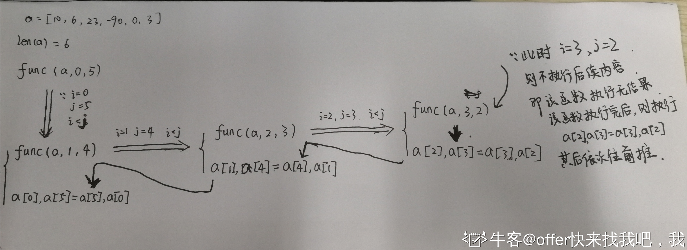
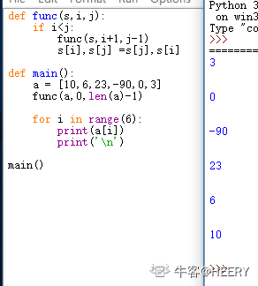
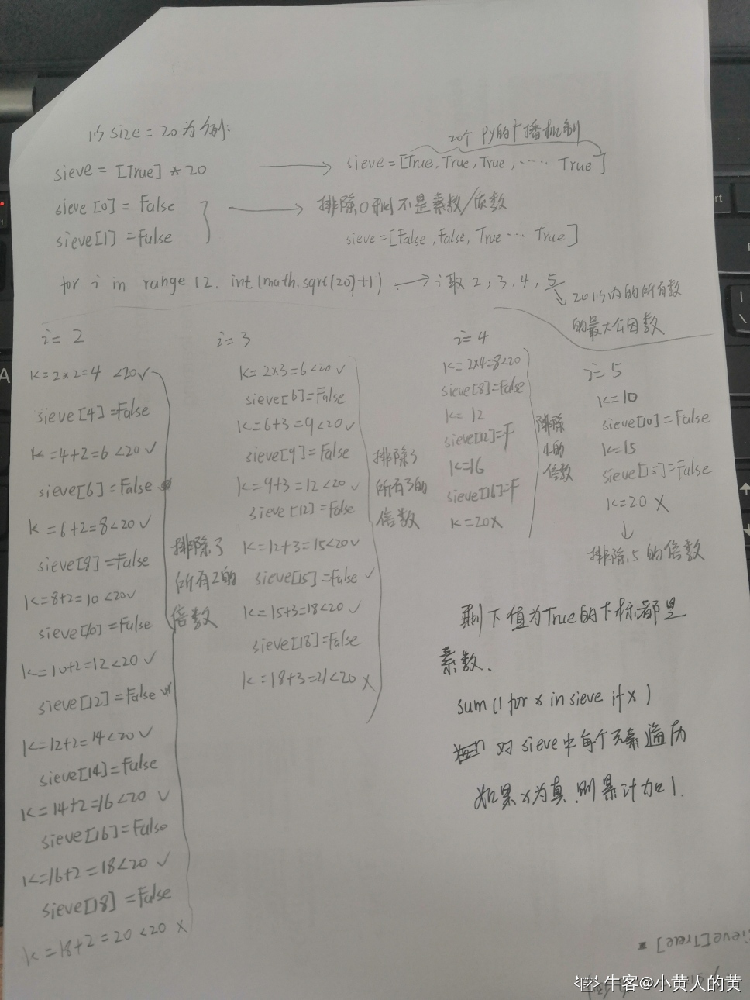
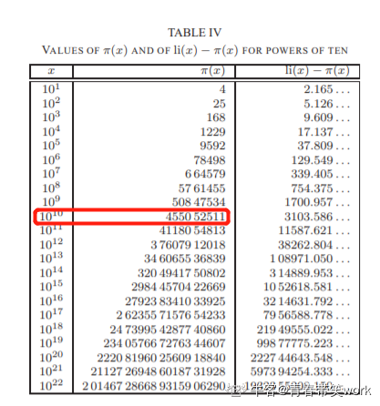
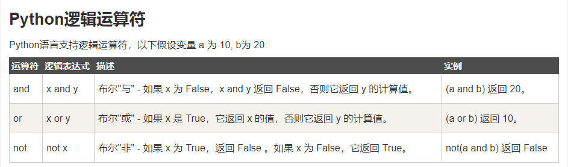
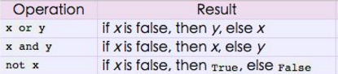

### 10. 下面程序运行结果为：

```python
for i in range(5):
    i += 1
    print("-------")
    if i == 3:
        continue
    print(i)
```

考察 continue 跳出本句的循环，但循环仍在继续。故 i = 3 时不进行打印

### 11.正确答案?

```python
def func(s, i, j):
    if i < j:
        func(s, i + 1, j - 1)
        s[i], s[j] = s[j], s[i]


def main():
    a = [10, 6, 23, -90, 0, 3]
    func(a, 0, len(a) - 1)
    for i in range(6):
        print(a[i])
        print("\n")


main()


3
0
‐90
23
6
10
```


解答：这是一道递归的题目

1.首先，调用main() 函数内，已经定义了一个列表 a ,传入到func函数内，第一次传入的参数中 i,j 分别代表列表的首位、末尾值。即

i = 0 ,j = 5 此时满足 i<j ,则此时调用 满足的条件 ，又调用func ，此时传入的参数为 a、1，4 。这时需要执行函数，而不能往下执行，即暂**不可**执行第一次的 交换元素 s[0],s[5] = s[5],s[0].

\2. 执行内部函数 func(a,1,4) 则也满足 1<4 此时还需要再调用 func(a,2,3) .暂不执行 s[1],s[4]] = s[4],s[1].

3.再执行内部函数 func(a,2,3) ,还是满足2<3 此时还需要再调用 func(a,3,2) .暂不执行 s[2],s[3]] = s[3],s[2].

4.再执行内部函数func(a,3,2),此时不满足 3<2 . 即不执行任何内容。此时内部循环函数全部结束。再往上推。

5.上一步内部函数执行完后，则执行交换s[2],s[3]] = s[3],s[2]. 再往上推

\6. s[1],s[4]] = s[4],s[1]，再往上推

\7. s[0],s[5] = s[5],s[0] 。即全部func结果结束。即交换了各个位置的元素。第一个变成最后一个、第二个变成倒数第二个、第三个变成倒数第三个。原来  的 a = [10,6,23,-90,0,3]

交换后的 a = [3,0,-90,23,6,10]

\8. for循环依次打印出a列表元素 ，每次打出一个都进行换行操作。

答案为 A

\###############################################################

【2021.4.28】    为了更好的说明，以上文字转为图片或许更好理解：



\#####

执行代码和结果 如下图所示



### 12.下面哪个是Python中的不变的数据结构？

```python
set
list
tuple
dict
```

Python标准的内置数据类型有：

**Number**(整数型 int , 浮点数型 float, 布尔型 bool , 复数 complex) 

**String List Tuple Set Dictionary**

Python可变数据类型：可改变变量的值，且不会新建对象

 List Dictionary Set

Python不可变数据类型：不允许变量的值发生改变，发生改变时会新建对象

 Tuple string Number

python中的数据类型:整型，字符串，元组(只读列表，只能查询，不可更改)，集合，列表，字典； 

==不可变==数据类型:整型，字符串，元组；当该数据类型的对应变量的值发生了改变，那么它对应的内存地址也会改变； 

==可变==数据类型: 集合，列表，字典；数据发生改变，但内存地址不变

### 13.What gets printed?()

```python
counter = 1 
def doLotsOfStuff(): 
    global counter
    for i in (1, 2, 3): 
        counter += 1 
doLotsOfStuff()
print counter
```

此题不难，主要是考察 global 的意义，即在局部作用域 doLotsOfStuff() 函数中，声明对全局作用域中的 counter 变量的引用，详情可参考：

> [Python3 函数](http://www.runoob.com/python3/python3-function.html)

最后要注意第 5 行的坑，是 `counter += 1` 而不是 `counter += i` ，因此答案是 4 而不是 7，选答案 C。

### 14. 关于Python内存管理，下列说法错误的是 

```
变量不必事先声明
变量无须先创建和赋值而直接使用
变量无须指定类型
可以使用del释放资源
```

本题答案选 B，原因如下：

1. Python 是弱类型脚本语言，变量就是变量，**没有特定类型**，因此**不需要声明**。
2. 但每个变量在**使用前都必须赋值**，变量赋值以后该变量才会被创建。
3. 用 del 语句可以**释放已创建的变量**（已占用的资源）。

详情可参考：

> [Python3 基本数据类型](http://www.runoob.com/python3/python3-data-type.html)
> [7.5. The del statement](https://docs.python.org/3.3/reference/simple_stmts.html#the-del-statement)

### 15.What gets printed?()

```python
kvps = { '1' : 1, '2' : 2 }
theCopy = kvps.copy()
kvps['1'] = 5
sum = kvps['1'] + theCopy['1']
print sum
```

### 16.下列Python语句正确的是

```
min = x  if  x < y   = y
max = x > y ? x : y
if (x > y)        print x
while True : pass
```

本题主要考察 Python 基本语法与运算符的使用，下面逐个分析每个选项：

A、**三元运算符的使用。**基本语法为：

```
a ``if` `condition ``else` `b
```

上述语句**当 condition 为真时等于 a，为假时等于 b**。因此 A 选项改为下列语句则正确：

```
min = x ``if` `x<y ``else` `y
```

B、还是三元运算符的使用，只不过 B 选项的用法**在 C、Java 等语言中成立，在 Python 中没有此用法**，正确用法参见选项 A。

C、if 语句**缺少冒号**，并且正确用法如下：

```
if` `(x>y): print x
```

D、while 语句与 pass 语句的使用。**pass语句为空语句，意义只是为了保持程序结构的完整性**。该选项写法正确，故选 D。

参考资料如下：

> [Ternary Operators](http://book.pythontips.com/en/latest/ternary_operators.html)
> [Does Python have a ternary conditional operator?](https://stackoverflow.com/questions/394809/does-python-have-a-ternary-conditional-operator)
> [pass 语句](http://www.runoob.com/python/python-pass-statement.html)
>
> 

### 17. 假设可以不考虑计算机运行资源（如内存）的限制，以下 python3 代码的预期运行结果是：（）

 ```python
 import math
 def sieve(size):
     sieve= [True] * size
     sieve[0] = False
     sieve[1] = False
     for i in range(2, int(math.sqrt(size)) + 1):
         k= i * 2
         while k < size:
            sieve[k] = False
            k += i
     return sum(1 for x in sieve if x)
 print(sieve(10000000000))
 
 455052510
 455052511
 455052512
 455052513
 ```

本题是通过排除法找素数的个数，以size为20为例，算法的思想就是先假设size以内的所有的数都为素数(sieve = [True] * size),然后在找到size以内的所有的因数(2,math.sqrt(size)+1)p排除掉所有因数的乘数(sieve[k]=False)，剩下的就是size内所有的素数。

math.sqrt(size)+1 为size以内的所有数的最大公因数。



http://sweet.ua.pt/tos/bib/5.4.pdf

### 18.有如下类定义，下列描述错误的是？
```python
class A(object):
pass

class B(A):
pass

b = B()


isinstance(b, A) == True
isinstance(b, object) == True
issubclass(B, A) == True
issubclass(b, B) == True
```

新式类：class 类（object基类）

继承类：class 子类（父类1[,父类2，父类3]）#在继承元组中列了一个以上的类，那么它就被称作"多重继承" 

class A(object):#新式类，相当于A继承object基类

pass

class B(A):#B类继承A类
pass

b = B()#实例化


isinstance() 函数来判断一个对象是否是一个已知的类型，类似 type()。

issubclass() 函数用于判断参数是否是类型参数的子类。

### 19.下列代码运行结果是？

```python
a = 'a'
print a > 'b' or 'c'


a
b
c
True
False
```



由于比较运算符优先级大于逻辑运算符，根据上表，**当 a > 'b'，即 'a' > 'b' 为 Fasle 时（'a' 的 ASCII 码比 ‘b’ 小），返回值为 'c'**，故答案选C。

详情可参考：[Python逻辑运算符](http://www.runoob.com/python3/python3-basic-operators.html#ysf4)(https://www.nowcoder.com/profile/688006823)

```
and，同真取最后一个真，有假取第一个假。
or，同假取最后一个假，有真取第一个真。 not，取反。
```

a > 'b' or 'c'

因为a的字符小于b,所以a>'b'为False,故print 'c'

a > 'b' and 'c

因为a的字符小于b,所以a>'b'为False,故print 'a>'b'为False

总结:

