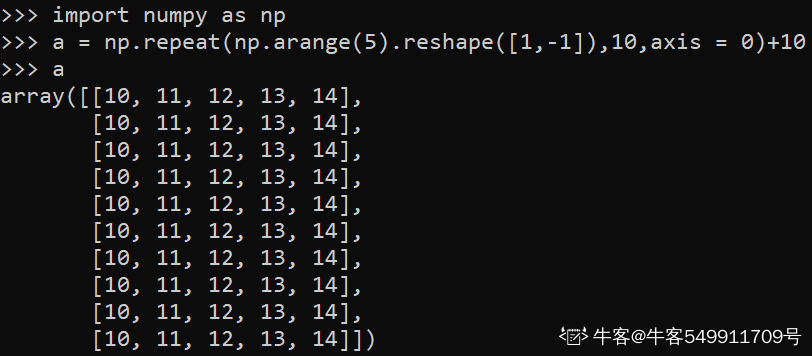

### 20.下列哪种类型是Python的映射类型？

```python
str
list
tuple
dict
```

字典是 Python 语言中唯一的映射类型。

映射是一种关联式的容器类型，它存储了对象与对象之间的映射关系，字典是python里唯一的映射类型，它存储了键值对的关联，是由键到键值的映射关系。

### 21. 以下程序输出为：

```python
# -*- coding:utf-8 -*-
def test(a, b, *args):
    print(a)
    print(b)
    print(args)
 
test(11, 22, 33, 44, 55, 66, 77, 88, 99)


11 22 (33, 44, 55, 66, 77, 88, 99)
编译错误
运行错误
11 22 (11,22，33, 44, 55, 66, 77, 88, 99)
```

def test(a,b,*args)

a,b位置参数；*args为不定长位置参数，传入的参数被放入一个元祖里。

所以，a,b分别被赋值11、22，而其他的数被存到一个元组里。

### 22. 以下程序输出为：

```python
info = {'name': '班长', 'id': 100, 'sex': 'f', 'address': '北京'}
age = info.get('age')
print(age)
age = info.get('age', 18)
print(age)
```

```
None 18
None None
编译错误
运行错误
```

考察字典的取值方法：

dict.get(key, default=None) 返回指定key在字典中的值，如果key在字典中不存在则返回default的值（default值默认为None，也可以自己指定）；

对比记忆：

dict['key'] 返回指定key在字典中的值，如果key则字典中不存在，则直接报错

dict.setdefault(key,default=None) 如果key在字典中存在，则返回key在字典中指定的值；如果key值不存在，则默认将key添加到字典中去，并将其值设置为default（default默认值为None，也可以自己指定）

### 23.下面的python3函数，如果输入的参数n非常大，函数的返回值会趋近于以下哪一个值（选项中的值用Python表达式来表示）（）

```python
import random 
def foo(n):   
        random.seed()
     c1 = 0
     c2 = 0
     for i in range(n):
        x = random.random()
        y = random.random()
        r1 = x * x + y * y
        r2 = (1 - x) * (1 - x) + (1 - y) * (1 - y)
        if r1 <= 1 and r2 <= 1:
           c1 += 1
         else:
           c2 += 1
    return   c1 / c2

```

```
4 / 3
(math.pi - 2) / (4 - math.pi)
math.e ** (6 / 21)
math.tan(53 / 180 * math.pi)
```


random.random()生成0和1之间的随机浮点数float


### 24.以下程序输出为：

```python
str = "Hello,Python";
suffix = "Python";
print (str.endswith(suffix,2));

TRUE
FALSE
语法错误
P
```

str.endswith(suffix[, start[, end]]) 用于判断字符串是否以指定后缀结尾，如果以指定后缀结尾返回True，否则返回False。
可选参数"start"与"end"为检索字符串的开始与结束位置。

忽略题目本身不严谨的格式，str.endswith(suffix,2) 中的2是指：从字符串"Hello,Python" 中的位置2，也就是第一个‘l’开始检索，判断是否以suffix结尾，故本题输出 True 。

### 25.已知print_func.py的代码如下：

```python
print('Hello
World!')
print('__name__
value: ', __name__)
 
def main():
   
print('This message is from main function')
 
if __name__ ==
'__main__':
   
main()
```

print_module.py的代码如下：

```python
import print_func
print("Done!")
```

运行print_module.py程序，结果是：

```
Hello World!  __name__ value: print_func  Done!
Hello World!  __name__ value: print_module  Done!
Hello World!  __name__ value: __main__  Done!
Hello World!  __name__ value:  Done!
```

应该选择A。

运行print_module.py后的结果如下:


自己运行自己的程序，__name__ 即为__main__

当程序当做脚本被别人调用运行时，其__name__ 为自己的模块名称，这里的print_func即被导入到print_module中当做脚本被运行时，则print_func的__name__即变为其自身的模块名。

详情见：https://blog.csdn.net/HEERY551/article/details/94736960

```
一个模块中有__name__``1.` `直接运行 __name__为 __main__``2.` `调用该模块,__name__为被调用模块的 模块名
```

自己运行自己的程序，__name__ 即为__main__

### 26.对于以下代码，描述正确的是：

```pyhton
list = ['1', '2', '3', '4', '5']
print list[10:]
```

```
导致 IndexError
输出['1', '2', '3', '4', '5']
编译错误
输出[]
```

切片操作不会引起下标越界异常

索引提示indexerror，切片不提示

python3关于切片的说明

The slice of s from i to j is defined as the sequence of items with index k such that i <= k < j.
If i&nbs***bsp;j is greater than len(s), use len(s).
If i is omitted or None, use 0.
If j is omitted or None, use len(s).
If i is greater than or equal to j, the slice is empty.

### 27.以上函数输出结果为()

```python
import numpy as np
a = np.repeat(np.arange(5).reshape([1,-1]),10,axis = 0)+10.0 b = np.random.randint(5, size= a.shape)
c = np.argmin(a*b, axis=1)
b = np.zeros(a.shape)
b[np.arange(b.shape[0]), c] = 1
print b
```

```
Hello World!
一个 shape = (5,10) 的随机整数矩阵
一个 shape = (5,10) 的 one-hot 矩阵
一个 shape = (10,5) 的 one-hot 矩阵
```



```python
#生成数组[0,1,2,3,4]
np.arange(5)
#原数组共有x个元素，reshape([n,-1])意思是将原数组重组为n行x/n列的新数组
#所以数组共有5个元素，重组为1行5列的数组
reshape([1,-1])
#因为axis=0，所以是沿着横轴方向重复，增加行数
#所以原数组增加10行
repeat(np.arange(5).reshape([1,-1]), 10, axis = 0)
#数组每个元素都+10
a = repeat(np.arange(5).reshape([1,-1]), 10, axis = 0) + 10
```


随机生成大小为a.shape的数组，数组元素为[0,5)区间范围的整数。


a*b组成的新数组，给出每行最小值的下标。


生成a.shape大小的全零数组。


b.shape[0]表示b的行数，10行

b[np.arange(10), c]=1表示np.arange(10)生成的数组中，所有c对应的位置全置为1。


```python
1
a = np.repeat(np.arange(5).reshape([1,-1]),10,axis = 0)+10.0 
np.repeat(a,b)将a重复b次，np.arange(5).reshape([1,-1])创建等差数组，1行，列未知
即【1，2，3，4，5】按行重复10次，广播每一个值加10
1
b = np.random.randint(5, size= a.shape)
生成[0,5)随机矩阵，大小和矩阵a相同
1
c = np.argmin(a*b, axis=1)
矩阵a和b乘积，返回每行最小值位置
1
b = np.zeros(a.shape)
与矩阵a相同大小的全零矩阵
1
b[np.arange(b.shape[0]), c] = 1
b中所有c返回位置置为1

```

### 28.python代码如下:

```python
foo = [1,2]
foo1 = foo
foo.append(3)
```

```
foo 值为[1,2]
foo 值为[1,2,3]
foo1 值为[1,2]
foo1 值为[1,2,3]
```

可变对象为引用传递，不可变对象为值传递。

第二行foo1 = foo，是将fool的地址赋予给fool，即foo与foo1指向内存中同一地址。

第三行当执行foo.append时，因为python中列表的值是可以变化的。所以就在原来的存放foo的内存地址改变了foo的值，由最初的[1, 2]变为[1, 2, 3]。由于foo1和foo 是指向同一地址空间的索引，所以当foo内存地址所存储的值被改变时，打印foo1时，foo1的值也变化了。


题目应该是foo1=foo 这样两者指的是同一个数据对象，即同一个内存地址，所以一动都动。这是深拷贝和浅拷贝的问题。

### 29.若 a = (1, 2, 3)，下列哪些操作是合法的? ABD

```
a[1:-1]
a*3
a[2] = 4
list(a)
```


直接看结果或许更清楚一点

总之一点 Tuple元素不能修改

A,B,D实际上并没有改变Tuple a的元素值


a[1:-1] ---->(2,)

a*3---->(1,2,3,1,2,3,1,2,3)

a是元组不可改变

list(a)----->[1,2,3]数组和列表可以相互转换


方括号是list，圆括号是tuple，tuple元素不可改变