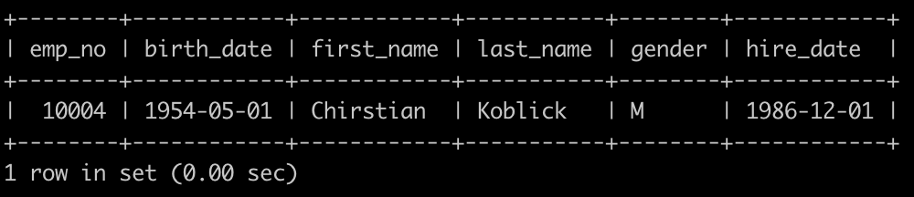

### 1.有一个员工employees表简况如下:


有一个员工employees表简况如下:


建表语句如下:

```sql
CREATE TABLE `employees` (
`emp_no` int(11) NOT NULL, 
`birth_date` date NOT NULL,
`first_name` varchar(14) NOT NULL,
`last_name` varchar(16) NOT NULL,
`gender` char(1) NOT NULL,
`hire_date` date NOT NULL,
PRIMARY KEY (`emp_no`));
```

请你查找employees里最晚入职员工的所有信息，以上例子输出如下:

示例1

## 输入

[复制](javascript:void(0);)

```
无
```

## 输出

[复制](javascript:void(0);)

```
无
```

