### 1. 查找最晚入职员工的所有信息


有一个员工employees表简况如下:


建表语句如下:

```sql
CREATE TABLE `employees` (
`emp_no` int(11) NOT NULL, 
`birth_date` date NOT NULL,
`first_name` varchar(14) NOT NULL,
`last_name` varchar(16) NOT NULL,
`gender` char(1) NOT NULL,
`hire_date` date NOT NULL,
PRIMARY KEY (`emp_no`));
INSERT INTO employees VALUES(10001,'1953-09-02','Georgi','Facello','M','1986-06-26');
INSERT INTO employees VALUES(10002,'1964-06-02','Bezalel','Simmel','F','1985-11-21');
INSERT INTO employees VALUES(10003,'1959-12-03','Parto','Bamford','M','1986-08-28');
INSERT INTO employees VALUES(10004,'1954-05-01','Chirstian','Koblick','M','1986-12-01');
INSERT INTO employees VALUES(10005,'1955-01-21','Kyoichi','Maliniak','M','1989-09-12');
INSERT INTO employees VALUES(10006,'1953-04-20','Anneke','Preusig','F','1989-06-02');
INSERT INTO employees VALUES(10007,'1957-05-23','Tzvetan','Zielinski','F','1989-02-10');
INSERT INTO employees VALUES(10008,'1958-02-19','Saniya','Kalloufi','M','1994-09-15');
INSERT INTO employees VALUES(10009,'1952-04-19','Sumant','Peac','F','1985-02-18');
INSERT INTO employees VALUES(10010,'1963-06-01','Duangkaew','Piveteau','F','1989-08-24');
INSERT INTO employees VALUES(10011,'1953-11-07','Mary','Sluis','F','1990-01-22');
```

请你查找employees里最晚入职员工的所有信息，以上例子输出如下:

示例1

## 输入

[复制](javascript:void(0);)

```
无
```

## 输出

[复制](javascript:void(0);)

```
无
```

```sql
select * from employees where hire_date = (select max(hire_date) from employees )
```


### 2. 查找入职员工时间排名倒数第三的员工所有信息

有一个员工employees表简况如下:

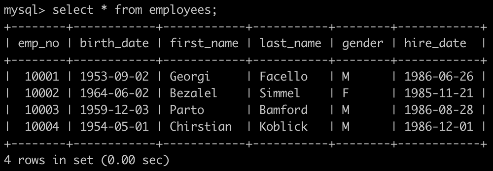

建表语句如下:

```sql
CREATE TABLE `employees` (
`emp_no` int(11) NOT NULL, 
`birth_date` date NOT NULL,
`first_name` varchar(14) NOT NULL,
`last_name` varchar(16) NOT NULL,
`gender` char(1) NOT NULL,
`hire_date` date NOT NULL,
PRIMARY KEY (`emp_no`));

INSERT INTO employees VALUES(10001,'1953-09-02','Georgi','Facello','M','1986-06-26');
INSERT INTO employees VALUES(10002,'1964-06-02','Bezalel','Simmel','F','1985-11-21');
INSERT INTO employees VALUES(10003,'1959-12-03','Parto','Bamford','M','1986-08-28');
INSERT INTO employees VALUES(10004,'1954-05-01','Chirstian','Koblick','M','1986-12-01');
INSERT INTO employees VALUES(10005,'1955-01-21','Kyoichi','Maliniak','M','1989-09-12');
INSERT INTO employees VALUES(10006,'1953-04-20','Anneke','Preusig','F','1989-06-02');
INSERT INTO employees VALUES(10007,'1957-05-23','Tzvetan','Zielinski','F','1989-02-10');
INSERT INTO employees VALUES(10008,'1958-02-19','Saniya','Kalloufi','M','1994-09-15');
INSERT INTO employees VALUES(10009,'1952-04-19','Sumant','Peac','F','1985-02-18');
INSERT INTO employees VALUES(10010,'1963-06-01','Duangkaew','Piveteau','F','1989-08-24');
INSERT INTO employees VALUES(10011,'1953-11-07','Mary','Sluis','F','1990-01-22');
```

请你查找employees里入职员工时间排名倒数第三的员工所有信息，以上例子输出如下:

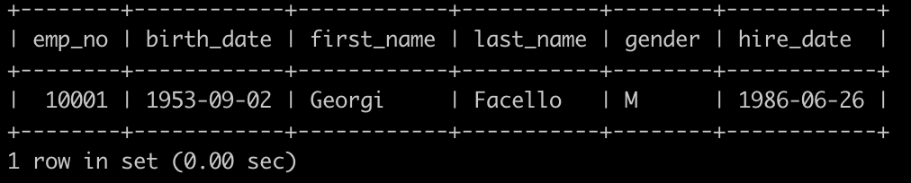

示例1

## 输入

[复制](javascript:void(0);)

```
无
```

## 输出

[复制](javascript:void(0);)

```
无
```

`Answer`:

```sql
/*way-1*/
select 
* 
from employees where hire_date=(
select
max(hire_date) from employees
where hire_date < (
select
max(hire_date)
from employees where hire_date<(
select 
max(hire_date) from employees
)
)
);

```

```sql
/*way-2*/
select * from employees 
where hire_date = (
    select distinct hire_date from employees order by hire_date desc limit 2,1
)
;
/*way-3*/
select *
from employees e1
where (select count(distinct e2.hire_date)
      from employees e2
      where e1.hire_date < e2.hire_date) = 2 #只需要找到日期小于其他人数为2即可。（注意倒数第三，其实日期是排第三）
      
/*way-4*/     
    select a.emp_no,
    a.birth_date,
    a.first_name,
    a.last_name,
    a.gender,
    a.hire_date
    from (
        select 
        t.*
        ,row_number() over(order by t.hire_date desc) as rn
        from employees t) a
where a.rn = 3
```

==LIMIT m,n : 表示从第m+1条开始，取n条数据；==

LIMIT n ： 表示从第0条开始，取n条数据，是limit(0,n)的缩写。

（1）首先需要加distinct去重。

假设 5-23（入职最晚日期）入职的有a,b,c 3人；

​    5-22（入职第二晚日期）入职的有d,e 2人；

​    5-21(入职倒数第三晚)入职的有f,g,h 3人；

​    5-21前入职的若干...

若 不加distinct去重，那么按照日期倒序，limit 2,1（从倒数第2行开始，取一条数据）的查询结果为 5-23

加了distinct去重，会按入职日期进行分组，多个相同入职日期会分为一组，这样limit 2,1的结果即为 5-21。

（2）外层的where条件中根据子查询查出的倒数第三晚入职的日期，就能查询出符合条件的员工信息。

---

考虑到入职日期可能会有多个重复，最合理的SQL语句应为:

```sql
SELECT * FROM employees 
WHERE hire_date = (
SELECT DISTINCT hire_date FROM employees 
ORDER BY hire_date DESC limit 2,1
);
```


下图为我建立的employees表，注意倒数第三个入职员工有两个日期相同，且倒数第一，倒数第二也有相同的：

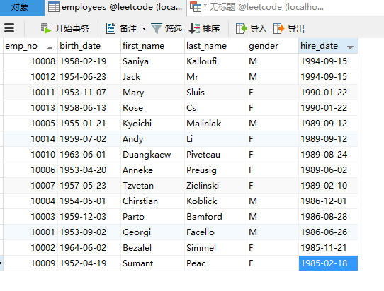

运行以上SQL语句的结果为正确的结果

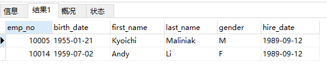

而运行 SELECT * FROM employees ORDER BY hire_date DESC LIMIT 2,1;的结果为下图，是不正确的

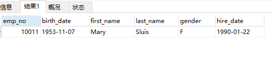

运行

```sql
 SELECT * FROM employees 
WHERE hire_date = (
SELECT hire_date FROM employees 
GROUP BY hire_date ORDER BY hire_date DESC limit 2,1
);
```

的结果也是正确的，如下图：

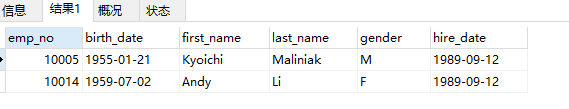

==但是实际测试的结果distinct比group by语句更快，而且内存占用也更小==

### 3. 查找各个部门当前领导当前薪水详情以及其对应部门编号dept_no

有一个全部员工的薪水表salaries简况如下:

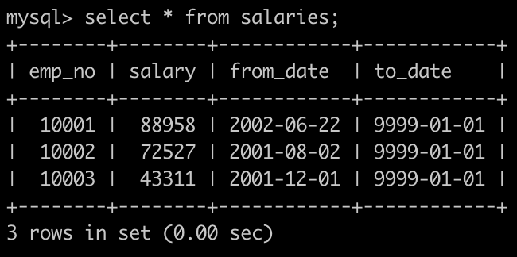


有一个各个部门的领导表dept_manager简况如下:

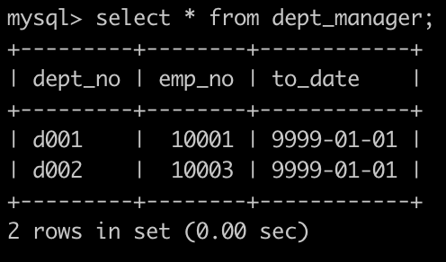

建表语句如下:

```sql
CREATE TABLE `salaries` (
`emp_no` int(11) NOT NULL,
`salary` int(11) NOT NULL,
`from_date` date NOT NULL,
`to_date` date NOT NULL,
PRIMARY KEY (`emp_no`,`from_date`));
```

```sql
CREATE TABLE `dept_manager` (
`dept_no` char(4) NOT NULL,
`emp_no` int(11) NOT NULL,
`to_date` date NOT NULL,
PRIMARY KEY (`emp_no`,`dept_no`));
```


请你查找各个部门领导薪水详情以及其对应部门编号dept_no，输出结果以salaries.emp_no升序排序，并且请注意输出结果里面dept_no列是最后一列，以上例子输入如下:

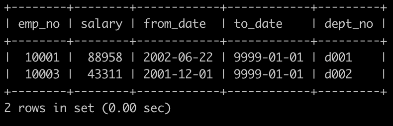

```sql
select
a.*,b.dept_no
from salaries a
inner join dept_manager b
on a.emp_no = b.emp_no
where a.to_date = '9999-01-01'
and b.to_date = '9999-01-01'
```

### 4.查找所有已经分配部门的员工的last_name和first_name以及dept_no

有一个员工表，employees简况如下:

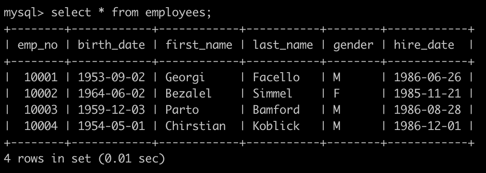

有一个部门表，dept_emp简况如下:

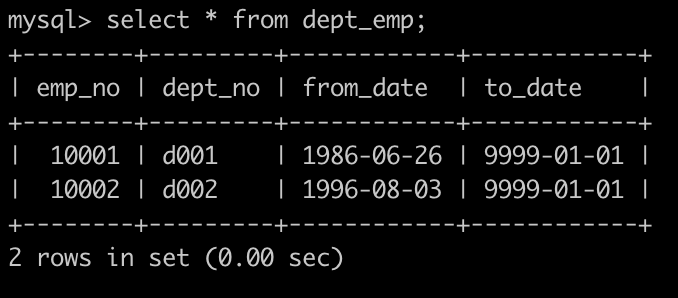

建表语句如下:

```sql
CREATE TABLE `employees` (
`emp_no` int(11) NOT NULL,
`birth_date` date NOT NULL,
`first_name` varchar(14) NOT NULL,
`last_name` varchar(16) NOT NULL,
`gender` char(1) NOT NULL,
`hire_date` date NOT NULL,
PRIMARY KEY (`emp_no`));
```

```sql
CREATE TABLE `dept_emp` (
`emp_no` int(11) NOT NULL,
`dept_no` char(4) NOT NULL,
`from_date` date NOT NULL,
`to_date` date NOT NULL,
PRIMARY KEY (`emp_no`,`dept_no`));
```


请你查找所有已经分配部门的员工的last_name和first_name以及dept_no，未分配的部门的员工不显示，以上例子如下:

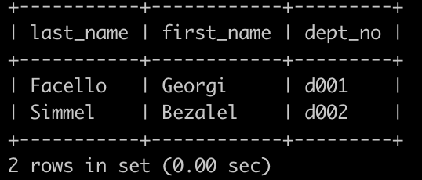

`Answer`:

```sql
select
a.last_name
,a.first_name
,b.dept_no
from employees a
inner join dept_emp b
on a.emp_no = b.emp_no
```

### 5.查找所有员工的last_name和first_name以及对应部门编号dept_no

有一个员工表，employees简况如下:


有一个部门表，dept_emp简况如下:


建表语句如下:

```sql
CREATE TABLE `employees` (
`emp_no` int(11) NOT NULL,
`birth_date` date NOT NULL,
`first_name` varchar(14) NOT NULL,
`last_name` varchar(16) NOT NULL,
`gender` char(1) NOT NULL,
`hire_date` date NOT NULL,
PRIMARY KEY (`emp_no`));
```

```sql
CREATE TABLE `dept_emp` (
`emp_no` int(11) NOT NULL,
`dept_no` char(4) NOT NULL,
`from_date` date NOT NULL,
`to_date` date NOT NULL,
PRIMARY KEY (`emp_no`,`dept_no`));
```


请你查找所有已经分配部门的员工的last_name和first_name以及dept_no，也包括暂时没有分配具体部门的员工，以上例子如下:

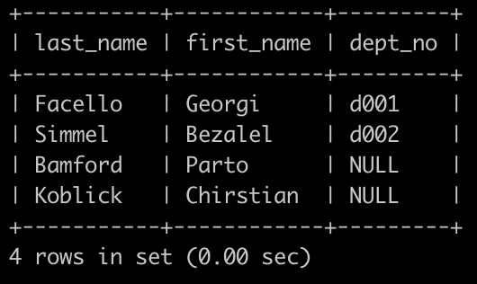

`Answer`:

```sql
select 
a.last_name
,a.first_name
,ifnull(b.dept_no,null) as dept_no
from employees a
left join dept_emp b
on a.emp_no = b.emp_no

```

### 7.查找薪水涨幅超过15次的员工号emp_no以及其对应的涨幅次数t

有一个薪水表，salaries简况如下:

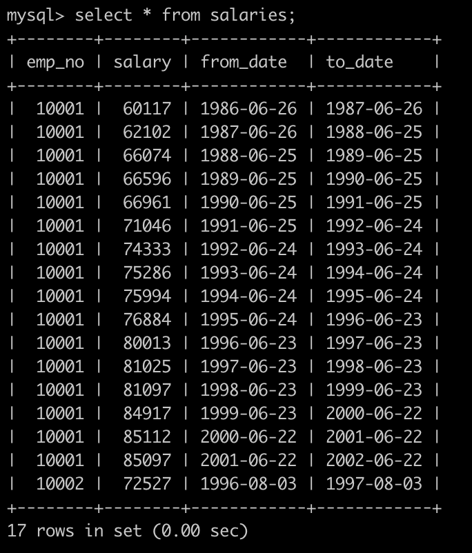

建表语句如下:

```sql
CREATE TABLE `salaries` (
`emp_no` int(11) NOT NULL,
`salary` int(11) NOT NULL,
`from_date` date NOT NULL,
`to_date` date NOT NULL,
PRIMARY KEY (`emp_no`,`from_date`));
```


请你查找薪水记录超过15次的员工号emp_no以及其对应的记录次数t，以上例子输出如下:

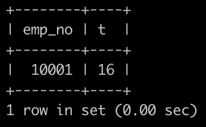

`Answer`:

```sql
select
emp_no
,count(emp_no) as t
from salaries
group by emp_no
having
count(emp_no)>15

select emp_no, count(to_date) as t
from salaries
group by emp_no
having t > 15;
```

### 8.找出所有员工当前具体的薪水salary情况

有一个薪水表，salaries简况如下:

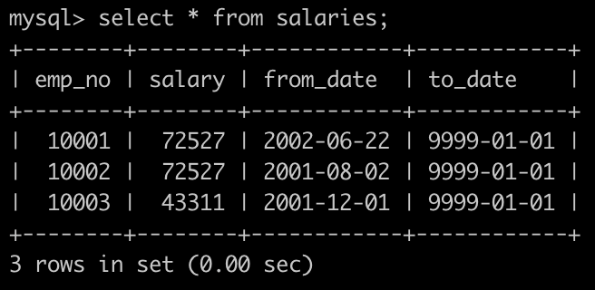

建表语句如下:

```sql
CREATE TABLE `employees` (
`emp_no` int(11) NOT NULL,
`birth_date` date NOT NULL,
`first_name` varchar(14) NOT NULL,
`last_name` varchar(16) NOT NULL,
`gender` char(1) NOT NULL,
`hire_date` date NOT NULL,
PRIMARY KEY (`emp_no`));
```

请你找出所有员工具体的薪水salary情况，对于相同的薪水只显示一次,并按照逆序显示，以上例子输出如下:

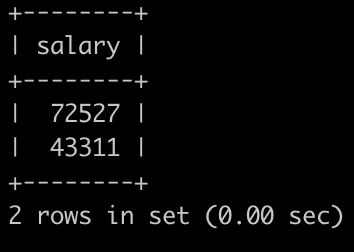

`Answer`:

```sql
select distinct salary
from salaries
where to_date='9999-01-01'
order by salary desc;

select 
s.salary
from
salaries s
where s.to_date = '9999-01-01'
group by s.salary
order by s.salary desc;
```

### 10.获取所有非manager的员工emp_no

有一个员工表employees简况如下:

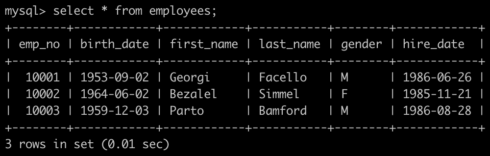

有一个部门领导表dept_manager简况如下:

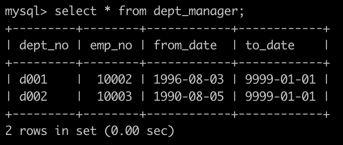

建表语句如下:

```sql
CREATE TABLE `employees` (
`emp_no` int(11) NOT NULL,
`birth_date` date NOT NULL,
`first_name` varchar(14) NOT NULL,
`last_name` varchar(16) NOT NULL,
`gender` char(1) NOT NULL,
`hire_date` date NOT NULL,
PRIMARY KEY (`emp_no`));

CREATE TABLE `dept_manager` (
`dept_no` char(4) NOT NULL,
`emp_no` int(11) NOT NULL,
`from_date` date NOT NULL,
`to_date` date NOT NULL,
PRIMARY KEY (`emp_no`,`dept_no`));
```

请你找出所有非部门领导的员工emp_no，以上例子输出:

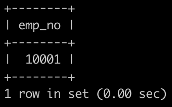

`Answer`:

```sql
select emp_no
from employees where emp_no 
not in (select emp_no from dept_manager);

select e.emp_no
from employees as e 
left join dept_manager as dm
on e.emp_no = dm.emp_no
where dm.dept_no is null;
```

