### 11. 获取所有员工当前的manager

有一个员工表dept_emp简况如下:

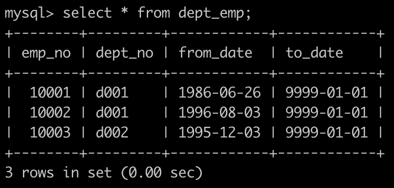

第一行表示为员工编号为10001的部门是d001部门。

有一个部门经理表dept_manager简况如下:

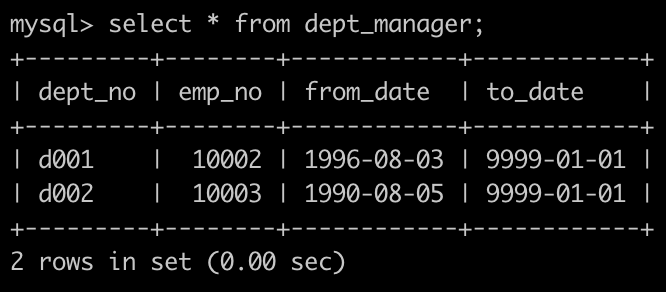

第一行表示为d001部门的经理是编号为10002的员工。

获取所有的员工和员工对应的经理，如果员工本身是经理的话则不显示，以上例子如下:

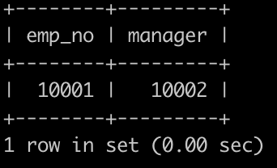


`Answer`:

```sql
select
a.emp_no
,b.emp_no as manager
from dept_emp a
inner join dept_manager b
on a.dept_no = b.dept_no
where a.to_date ='9999-01-01'
and b.to_date = '9999-01-01'
AND a.emp_no <> b.emp_no
```

### 12.获取所有部门中当前员工薪水最高的相关信息

有一个员工表dept_emp简况如下:

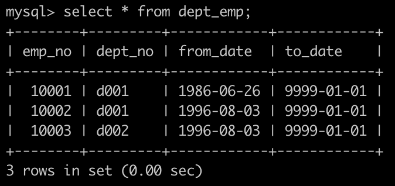

有一个薪水表salaries简况如下:

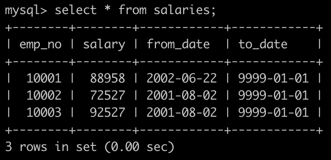

获取每个部门中当前员工薪水最高的相关信息，给出dept_no, emp_no以及其对应的salary，按照部门编号升序排列，以上例子输出如下:

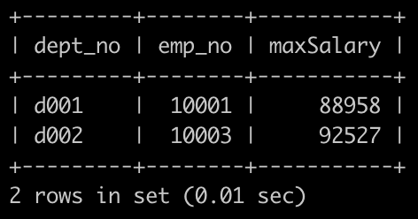

`Answer`:

```sql
select 
 a.dept_no
,a.emp_no
,a.salary
 from (select 
a.*,b.salary
from dept_emp a 
inner join salaries b 
on a.emp_no = b.emp_no
where a.to_date ='9999-01-01'
    and b.to_date ='9999-01-01') a
where  
(a.dept_no,a.salary) in (
select 
a.dept_no
,max(b.salary) as salary
from dept_emp a 
inner join salaries b
on a.emp_no = b.emp_no
where a.to_date ='9999-01-01'
    and b.to_date ='9999-01-01'
group by 
a.dept_no
)
order by  a.dept_no asc;


/*
1、方法一：使用窗口排序函数
【注】DENSE_RANK() OVER（PARTITION dept_no ORDER BY salary DESC）可以得出以
部门为单位的员工的工资排名，可以满足并列第1的要求
*/
select
a.dept_no
,a.emp_no
,a.salary
from (
select  
a.dept_no
,a.emp_no
,a.salary
,dense_rank() over(partition by a.dept_no order by a.salary desc) rn
from
(
select
a.dept_no
,a.emp_no
,b.salary
from dept_emp a
inner join salaries b
on a.emp_no = b.emp_no
where a.to_date='9999-01-01'
    and b.to_date='9999-01-01'
) a
    )a
where a.rn=1
order by a.dept_no;


/*2、方法二：如果mysql数据库没有排序函数，则可以使用非等值自连接的方法来实现类似DENSE_RANK()
函数的功能，语句比较长，可以不过原理简单的，如下：*/
SELECT D.dept_no,D.emp_no,D.salary FROM(
    SELECT (
        SELECT COUNT( DISTINCT F.salary ) 
            FROM(
                  SELECT
                    A.dept_no,
                    A.emp_no,
                    B.salary 
                  FROM
                    dept_emp A
                    INNER JOIN salaries B ON A.emp_no = B.emp_no 
                  WHERE
                    A.to_date = '9999-01-01' 
                    AND B.to_date = '9999-01-01' 
                ) AS F 
        WHERE
            F.salary >= C.salary 
            AND F.dept_no = C.dept_no 
        ) AS raking,
           C.dept_no,C.emp_no,C.salary FROM (
            SELECT
                A.dept_no,
                A.emp_no,
                B.salary
            FROM 
                dept_emp A
            INNER JOIN salaries B ON A.emp_no = B.emp_no
            WHERE 
            A.to_date = '9999-01-01'
            AND B.to_date = '9999-01-01' ) C ) D 
WHERE D.raking = 1
ORDER BY D.dept_no
```

### 15.查找employees表所有emp_no为奇数

有一个员工表employees简况如下:

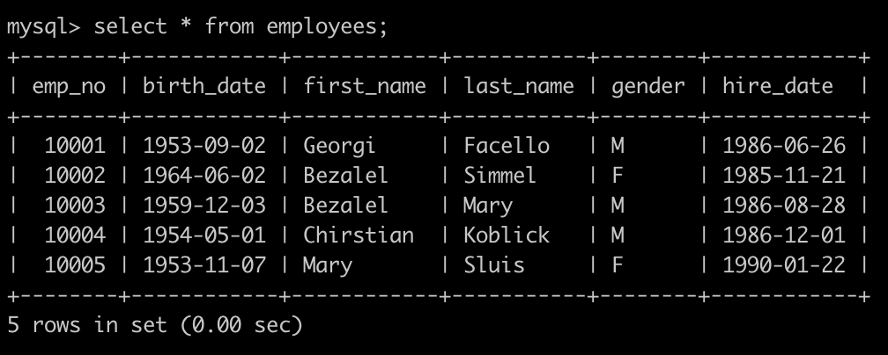

建表语句如下:

```sql
CREATE TABLE `employees` (
`emp_no` int(11) NOT NULL,
`birth_date` date NOT NULL,
`first_name` varchar(14) NOT NULL,
`last_name` varchar(16) NOT NULL,
`gender` char(1) NOT NULL,
`hire_date` date NOT NULL,
PRIMARY KEY (`emp_no`));
```


请你查找employees表所有emp_no为奇数，且last_name不为Mary的员工信息，并按照hire_date逆序排列，以上例子查询结果如下:

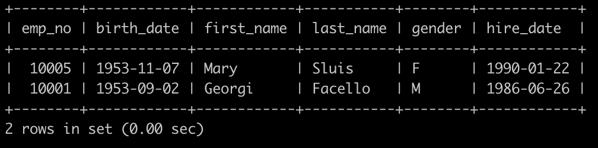

`Answer`:

```sql
select
* from employees
where emp_no % 2 =1
and last_name<>'Mary'
order by hire_date desc;
```

### 16.统计出当前各个title类型对应的员工当前薪水对应的平均工资

有一个员工职称表titles简况如下:

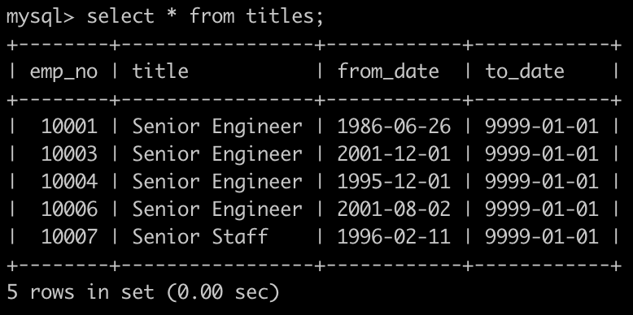

有一个薪水表salaries简况如下:

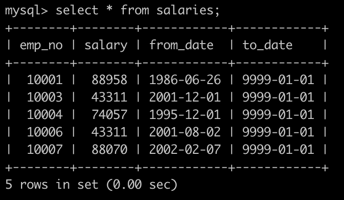

建表语句如下:

```sql
CREATE TABLE titles (
`emp_no` int(11) NOT NULL,
`title` varchar(50) NOT NULL,
`from_date` date NOT NULL,
`to_date` date DEFAULT NULL);

CREATE TABLE `salaries` (
`emp_no` int(11) NOT NULL,
`salary` int(11) NOT NULL,
`from_date` date NOT NULL,
`to_date` date NOT NULL,
PRIMARY KEY (`emp_no`,`from_date`));
```

请你统计出各个title类型对应的员工薪水对应的平均工资avg。结果给出title以及平均工资avg，并且以avg升序排序，以上例子输出如下:
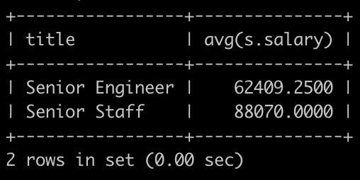

`Answer`:

```sql
select
a.title
,avg(b.salary)
from titles a
inner join salaries b
on a.emp_no = b.emp_no
where a.to_date = '9999-01-01'
and b.to_date = '9999-01-01'
group by 
a.title
order by avg(b.salary) asc;
```

### 17.获取当前薪水第二多的员工的emp_no以及其对应的薪水salary

有一个薪水表salaries简况如下:

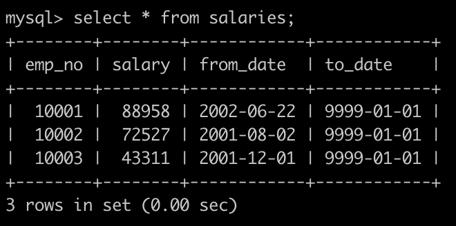

请你获取薪水第二多的员工的emp_no以及其对应的薪水salary

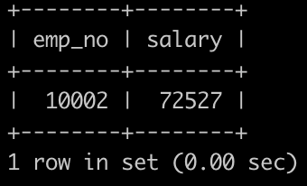

`Answer`:

```sql
select emp_no, salary from salaries
where to_date = '9999-01-01' and salary = (select distinct salary from salaries order by salary desc limit 1,1)
```

避免了2个问题：

(1) 首先这样可以解决多个人工资相同的问题；

(2) 另外，筛选出第二多的工资时要注意distinct salary，否则不能选出第二多的工资。