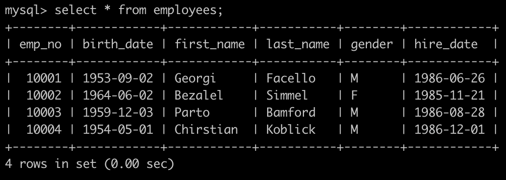
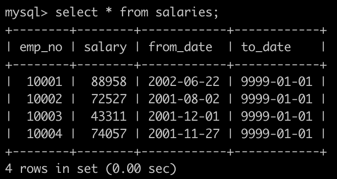
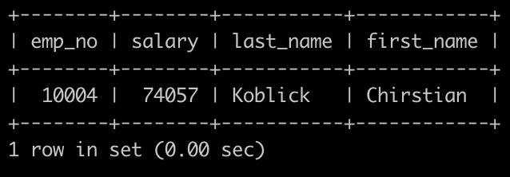
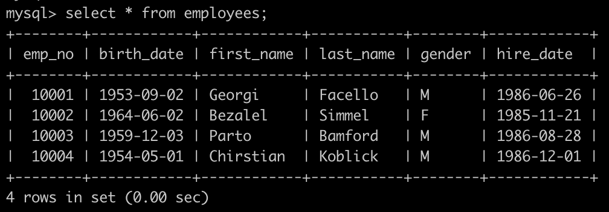
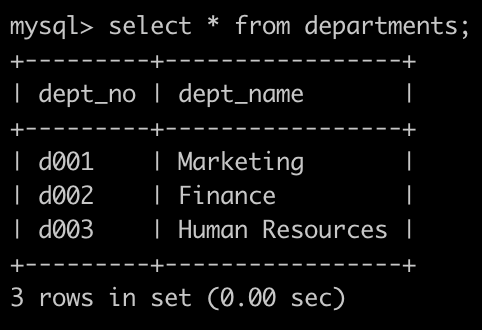
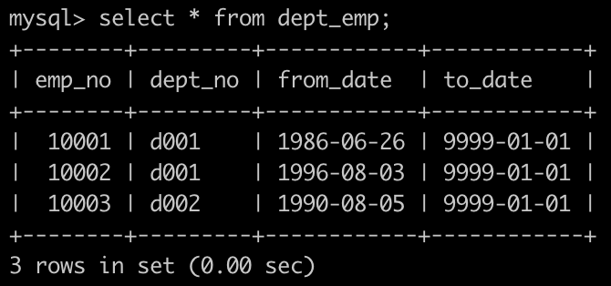
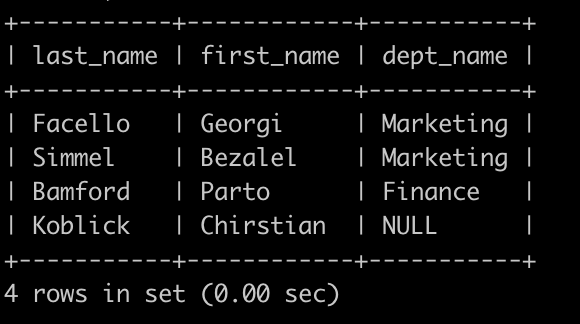

### 11. 获取所有员工当前的manager

有一个员工表dept_emp简况如下:


第一行表示为员工编号为10001的部门是d001部门。

有一个部门经理表dept_manager简况如下:


第一行表示为d001部门的经理是编号为10002的员工。

获取所有的员工和员工对应的经理，如果员工本身是经理的话则不显示，以上例子如下:


`Answer`:

```sql
select
a.emp_no
,b.emp_no as manager
from dept_emp a
inner join dept_manager b
on a.dept_no = b.dept_no
where a.to_date ='9999-01-01'
and b.to_date = '9999-01-01'
AND a.emp_no <> b.emp_no
```

### 12.获取所有部门中当前员工薪水最高的相关信息

有一个员工表dept_emp简况如下:


有一个薪水表salaries简况如下:


获取每个部门中当前员工薪水最高的相关信息，给出dept_no, emp_no以及其对应的salary，按照部门编号升序排列，以上例子输出如下:


`Answer`:

```sql
select 
 a.dept_no
,a.emp_no
,a.salary
 from (select 
a.*,b.salary
from dept_emp a 
inner join salaries b 
on a.emp_no = b.emp_no
where a.to_date ='9999-01-01'
    and b.to_date ='9999-01-01') a
where  
(a.dept_no,a.
) in (
select 
a.dept_no
,max(b.salary) as salary
from dept_emp a 
inner join salaries b
on a.emp_no = b.emp_no
where a.to_date ='9999-01-01'
    and b.to_date ='9999-01-01'
group by 
a.dept_no
)
order by  a.dept_no asc;


/*
1、方法一：使用窗口排序函数
【注】DENSE_RANK() OVER（PARTITION dept_no ORDER BY salary DESC）可以得出以
部门为单位的员工的工资排名，可以满足并列第1的要求
*/
select
a.dept_no
,a.emp_no
,a.salary
from (
select  
a.dept_no
,a.emp_no
,a.salary
,dense_rank() over(partition by a.dept_no order by a.salary desc) rn
from
(
select
a.dept_no
,a.emp_no
,b.salary
from dept_emp a
inner join salaries b
on a.emp_no = b.emp_no
where a.to_date='9999-01-01'
    and b.to_date='9999-01-01'
) a
    )a
where a.rn=1
order by a.dept_no;


/*2、方法二：如果mysql数据库没有排序函数，则可以使用非等值自连接的方法来实现类似DENSE_RANK()
函数的功能，语句比较长，可以不过原理简单的，如下：*/
SELECT D.dept_no,D.emp_no,D.salary FROM(
    SELECT (
        SELECT COUNT( DISTINCT F.salary ) 
            FROM(
                  SELECT
                    A.dept_no,
                    A.emp_no,
                    B.salary 
                  FROM
                    dept_emp A
                    INNER JOIN salaries B ON A.emp_no = B.emp_no 
                  WHERE
                    A.to_date = '9999-01-01' 
                    AND B.to_date = '9999-01-01' 
                ) AS F 
        WHERE
            F.salary >= C.salary 
            AND F.dept_no = C.dept_no 
        ) AS raking,
           C.dept_no,C.emp_no,C.salary FROM (
            SELECT
                A.dept_no,
                A.emp_no,
                B.salary
            FROM 
                dept_emp A
            INNER JOIN salaries B ON A.emp_no = B.emp_no
            WHERE 
            A.to_date = '9999-01-01'
            AND B.to_date = '9999-01-01' ) C ) D 
WHERE D.raking = 1
ORDER BY D.dept_no
```

### 15.查找employees表所有emp_no为奇数

有一个员工表employees简况如下:


建表语句如下:

```sql
CREATE TABLE `employees` (
`emp_no` int(11) NOT NULL,
`birth_date` date NOT NULL,
`first_name` varchar(14) NOT NULL,
`last_name` varchar(16) NOT NULL,
`gender` char(1) NOT NULL,
`hire_date` date NOT NULL,
PRIMARY KEY (`emp_no`));
```


请你查找employees表所有emp_no为奇数，且last_name不为Mary的员工信息，并按照hire_date逆序排列，以上例子查询结果如下:


`Answer`:

```sql
select
* from employees
where emp_no % 2 =1
and last_name<>'Mary'
order by hire_date desc;
```

### 16.统计出当前各个title类型对应的员工当前薪水对应的平均工资

有一个员工职称表titles简况如下:


有一个薪水表salaries简况如下:


建表语句如下:

```sql
CREATE TABLE titles (
`emp_no` int(11) NOT NULL,
`title` varchar(50) NOT NULL,
`from_date` date NOT NULL,
`to_date` date DEFAULT NULL);

CREATE TABLE `salaries` (
`emp_no` int(11) NOT NULL,
`salary` int(11) NOT NULL,
`from_date` date NOT NULL,
`to_date` date NOT NULL,
PRIMARY KEY (`emp_no`,`from_date`));
```

请你统计出各个title类型对应的员工薪水对应的平均工资avg。结果给出title以及平均工资avg，并且以avg升序排序，以上例子输出如下:


`Answer`:

```sql
select
a.title
,avg(b.salary)
from titles a
inner join salaries b
on a.emp_no = b.emp_no
where a.to_date = '9999-01-01'
and b.to_date = '9999-01-01'
group by 
a.title
order by avg(b.salary) asc;
```

### 17.获取当前薪水第二多的员工的emp_no以及其对应的薪水salary

有一个薪水表salaries简况如下:


请你获取薪水第二多的员工的emp_no以及其对应的薪水salary


`Answer`:

```sql
select emp_no, salary from salaries
where to_date = '9999-01-01' and salary = (select distinct salary from salaries order by salary desc limit 1,1);


select 
emp_no
,salary
from salaries
where salary=(
select
max(salary)
from salaries
where salary <(
select 
max(salary)
from salaries
where to_date = '9999-01-01')
);

a.emp_no
,a.salary
from salaries a
where to_date = '9999-01-01'
and 1 =(select count(distinct b.emp_no) from salaries b where a.salary<b.salary);


```

避免了2个问题：

(1) 首先这样可以解决多个人工资相同的问题；

(2) 另外，筛选出第二多的工资时要注意distinct salary，否则不能选出第二多的工资。

### 18.获取当前薪水第二多的员工的emp_no以及其对应的薪水salary

有一个员工表employees简况如下:



有一个薪水表salaries简况如下:



请你查找薪水排名第二多的员工编号emp_no、薪水salary、last_name以及first_name，**不能使用order by完成**，以上例子输出为:

**（温馨提示:sqlite通过的代码不一定能通过mysql，因为SQL语法规定，使用聚合函数时，select子句中一般只能存在以下三种元素：常数、聚合函数，group by 指定的列名。如果使用非group by的列名，sqlite的结果和mysql 可能不一样)**



示例1

## 输入

[复制](javascript:void(0);)

```
drop table if exists  `employees` ; 
drop table if exists  `salaries` ; 
CREATE TABLE `employees` (
`emp_no` int(11) NOT NULL,
`birth_date` date NOT NULL,
`first_name` varchar(14) NOT NULL,
`last_name` varchar(16) NOT NULL,
`gender` char(1) NOT NULL,
`hire_date` date NOT NULL,
PRIMARY KEY (`emp_no`));
CREATE TABLE `salaries` (
`emp_no` int(11) NOT NULL,
`salary` int(11) NOT NULL,
`from_date` date NOT NULL,
`to_date` date NOT NULL,
PRIMARY KEY (`emp_no`,`from_date`));
INSERT INTO employees VALUES(10001,'1953-09-02','Georgi','Facello','M','1986-06-26');
INSERT INTO employees VALUES(10002,'1964-06-02','Bezalel','Simmel','F','1985-11-21');
INSERT INTO employees VALUES(10003,'1959-12-03','Parto','Bamford','M','1986-08-28');
INSERT INTO employees VALUES(10004,'1954-05-01','Chirstian','Koblick','M','1986-12-01');
INSERT INTO salaries VALUES(10001,88958,'2002-06-22','9999-01-01');
INSERT INTO salaries VALUES(10002,72527,'2001-08-02','9999-01-01');
INSERT INTO salaries VALUES(10003,43311,'2001-12-01','9999-01-01');
INSERT INTO salaries VALUES(10004,74057,'2001-11-27','9999-01-01');
```

## 输出

[复制](javascript:void(0);)

```
10004|74057|Koblick|Chirstian
```

`Answer`

薪水第二多，意思就是只有一个人比他多，这样只要用salary表内连接，再分组，组内条数等于1的那条记录，就正好是第二多。如果要找第三多，那就让having count(*)=2就行了，只有两个人比那个人多。。还可扩展呢~

不过如果，有两个人比那个人多，这两个人的薪水值相同的话，还得用一下distinct关键字消除。

```sql
/*
1、方法一：1 = (select count(distinct b.salary) from salaries b where a.salary < b.salary)
*/
select 
a.emp_no
,b.salary
,a.last_name
,a.first_name
from employees a
inner join (
select
a.*
from salaries a
where a.to_date = '9999-01-01'
    and 1 = (select count(distinct b.salary) from salaries b where a.salary < b.salary)) b
on a.emp_no = b.emp_no
group by 
a.emp_no
,b.salary
,a.last_name
,a.first_name;
#运行时间 41ms
#占用内存 5368KB

/*
2、方法一：group by a.emp_no having count(*) = 1
*/
select 
a.emp_no
,b.salary
,a.last_name
,a.first_name
from employees a
inner join (
select
a.emp_no
,a.salary
from salaries a
inner join salaries b
on a.salary < b.salary
where a.to_date = '9999-01-01'
and b.to_date = '9999-01-01'
group by a.emp_no
having count(*) = 1
    ) b
on a.emp_no = b.emp_no;
#运行时间 38ms
#占用内存 5420KB

```

### 19.查找所有员工的last_name和first_name以及对应的dept_name

有一个员工表employees简况如下:



有一个部门表departments表简况如下:



有一个，部门员工关系表dept_emp简况如下:



请你查找所有员工的last_name和first_name以及对应的dept_name，也包括暂时没有分配部门的员工，以上例子输出如下:



```sql
select
a.last_name,a.first_name,c.dept_name
from 
employees a
left join dept_emp b
on a.emp_no = b.emp_no
left join departments c
on b.dept_no = c.dept_no
;


select e.last_name,e.first_name,t.dept_name
from employees as e left join
(select de.emp_no, d.dept_name from dept_emp as de left join departments as d on de.dept_no = d.dept_no) as t
on e.emp_no = t.emp_no;
```

