### 21.查找在职员工自入职以来的薪水涨幅情况

有一个员工表employees简况如下:

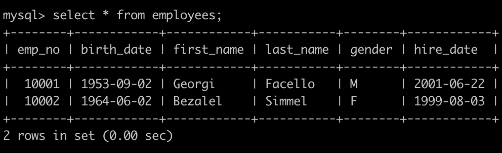

有一个薪水表salaries简况如下:

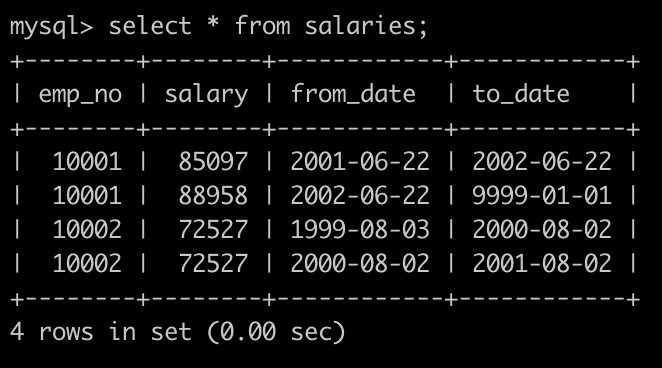

请你查找在职员工自入职以来的薪水涨幅情况，给出在职员工编号emp_no以及其对应的薪水涨幅growth，并按照growth进行升序，以上例子输出为

（注: to_date为薪资调整某个结束日期，或者为离职日期，to_date='9999-01-01'时，表示依然在职，无后续调整记录）

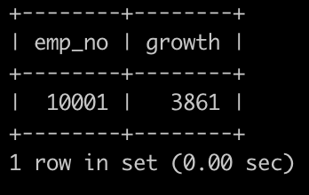


示例1

## 输入

[复制](javascript:void(0);)

```sql
drop table if exists  `employees` ; 
drop table if exists  `salaries` ;
CREATE TABLE `employees` (
`emp_no` int(11) NOT NULL,
`birth_date` date NOT NULL,
`first_name` varchar(14) NOT NULL,
`last_name` varchar(16) NOT NULL,
`gender` char(1) NOT NULL,
`hire_date` date NOT NULL,
PRIMARY KEY (`emp_no`));
CREATE TABLE `salaries` (
`emp_no` int(11) NOT NULL,
`salary` int(11) NOT NULL,
`from_date` date NOT NULL,
`to_date` date NOT NULL,
PRIMARY KEY (`emp_no`,`from_date`));
INSERT INTO employees VALUES(10001,'1953-09-02','Georgi','Facello','M','2001-06-22');
INSERT INTO employees VALUES(10002,'1964-06-02','Bezalel','Simmel','F','1999-08-03');
INSERT INTO salaries VALUES(10001,85097,'2001-06-22','2002-06-22');
INSERT INTO salaries VALUES(10001,88958,'2002-06-22','9999-01-01');
INSERT INTO salaries VALUES(10002,72527,'1999-08-03','2000-08-02');
INSERT INTO salaries VALUES(10002,72527,'2000-08-02','2001-08-02');
```

## 输出

[复制](javascript:void(0);)

```
10001|3861
```

```sql
select 
a.emp_no,(b.salary-c.salary) as rowth
from employees a
inner join salaries b
on a.emp_no  = b.emp_no 
and b.to_date = '9999-01-01'
inner join salaries c
on a.emp_no  = c.emp_no  
and a.hire_date = c.from_date
order by rowth asc
;
```

### 22.统计各个部门的工资记录数

有一个部门表departments简况如下:

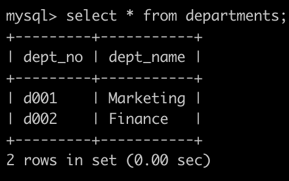

有一个，部门员工关系表dept_emp简况如下:

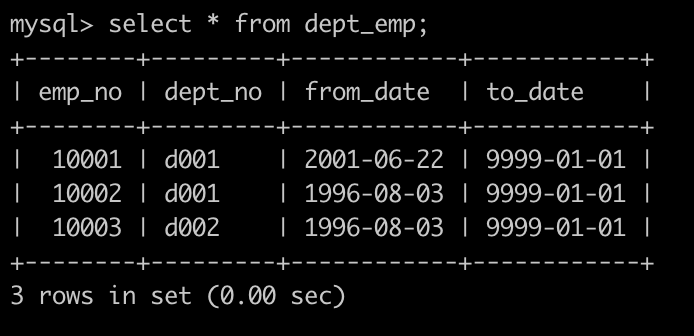

有一个薪水表salaries简况如下:

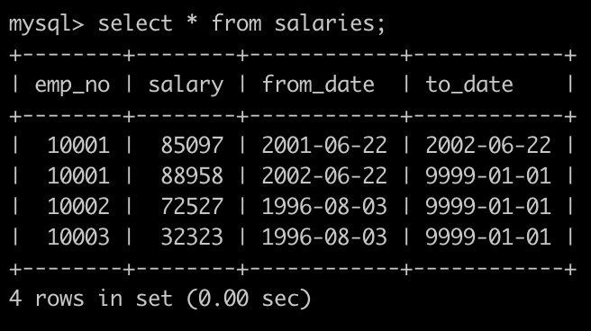

请你统计各个部门的工资记录数，给出部门编码dept_no、部门名称dept_name以及部门在salaries表里面有多少条记录sum，按照dept_no升序排序，以上例子输出如下:

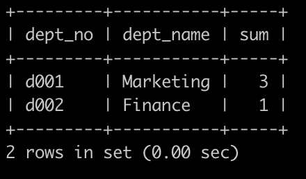

```sql
#请你统计各个部门的工资记录数，给出部门编码dept_no、部门名称dept_name
#以及部门在salaries表里面有多少条记录sum，按照dept_no升序排序，以上例子输出如下:

select a.dept_no,a.dept_name,b.sum
from departments a,
(select  
    a.dept_no
    ,count(salary) as sum
    from dept_emp a 
    inner join salaries b
    on a.emp_no = b.emp_no
    group by a.dept_no

) b
where a.dept_no = b.dept_no
group by a.dept_no 
order by a.dept_no;


select d.dept_no,d.dept_name,count(s.salary) as sum
from departments d
inner join dept_emp de
on d.dept_no = de.dept_no
inner join salaries s
on de.emp_no = s.emp_no
group by d.dept_no
order by d.dept_no;
```

### 23.**对所有员工的薪水按照salary进行按照1-N的排名**

有一个薪水表salaries简况如下:

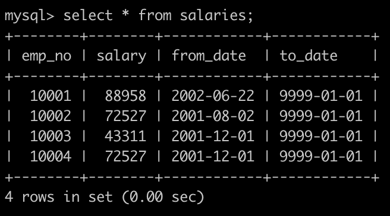

对所有员工的薪水按照salary进行按照1-N的排名，相同salary并列且按照emp_no升序排列：

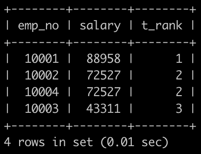

```sql
select 
a.emp_no
,a.salary
,count(distinct b.salary) as t_ank
from salaries a ,salaries b 
where
a.to_date = '9999-01-01'
and a.to_date = '9999-01-01'
and a.salary <= b.salary
group by
a.emp_no
order by a.salary desc,a.emp_no;
```

### 24.**获取所有非manager员工当前的薪水情况**

```sql
# 获取所有非manager员工薪水情况，给出dept_no、emp_no以及salary，
# 1.所有员工的信息
# 2.部门经理的信息
# 3.不再部门经理中的信息


select
de.dept_no
,e.emp_no
,s.salary
from employees e
inner join salaries s
on e.emp_no = s.emp_no and s.to_date = '9999-01-01'
inner join dept_emp de
on e.emp_no = de.dept_no
where de.emp_no not in (
    select
 dm.emp_no from dept_manager dm
where dm.to_date = '9999-01-01'
);


select de.dept_no, de.emp_no, s.salary
from dept_emp de, salaries s
where de.emp_no = s.emp_no and s.to_date = '9999-01-01'
and de.emp_no not in
    (select dm.emp_no from dept_manager dm where dm.to_date = '9999-01-01')
order by de.emp_no;
```

### 25.获取员工其当前的薪水比其manager当前薪水还高的相关信息

有一个，部门关系表dept_emp简况如下: 

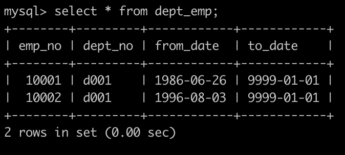

有一个部门经理表dept_manager简况如下:

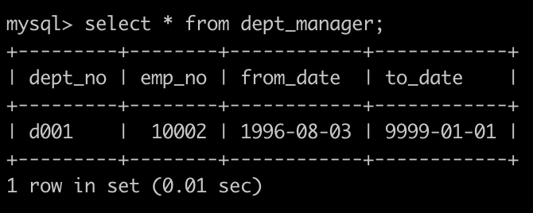

有一个薪水表salaries简况如下: 

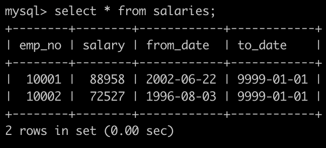

获取员工其当前的薪水比其manager当前薪水还高的相关信息，

第一列给出员工的emp_no，
第二列给出其manager的manager_no，
第三列给出该员工当前的薪水emp_salary,
第四列给该员工对应的manager当前的薪水manager_salary

以上例子输出如下:

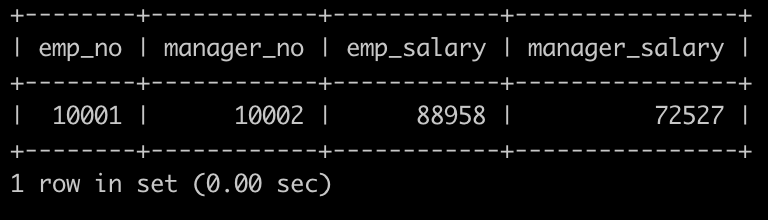

```sql
select a.emp_no,b.emp_no as manager_no,a.salary as mp_salary,b.salary as manager_salary
from (
select 
de.emp_no
,de.dept_no
,s1.salary
from dept_emp de
inner join salaries s1
on de.emp_no = s1.emp_no
and de.to_date='9999-01-01'
) a ,(
select 
dm.emp_no
,dm.dept_no
,s2.salary
from
dept_manager dm
inner join salaries s2
on dm.emp_no = s2.emp_no
and dm.to_date = '9999-01-01'
    ) b
where a.dept_no = b.dept_no and 
a.salary > b.salary;
```

### 26.汇总各个部门当前员工的title类型的分配数目

有一个部门表departments简况如下: 

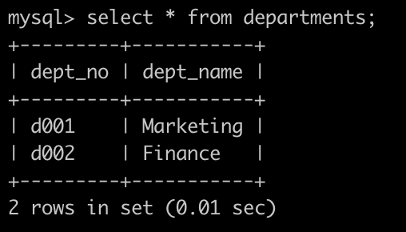

有一个，部门员工关系表dept_emp简况如下: 

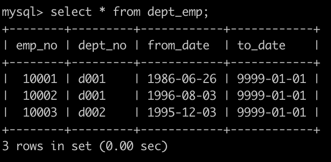

有一个职称表titles简况如下: 

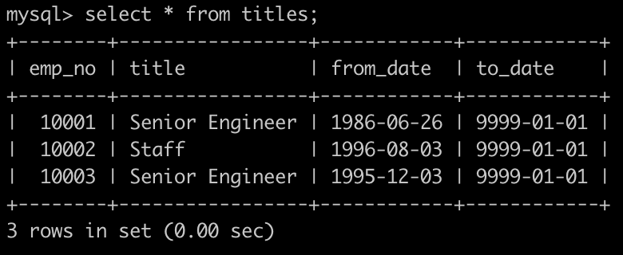

汇总各个部门当前员工的title类型的分配数目，即结果给出部门编号dept_no、dept_name、其部门下所有的员工的title以及该类型title对应的数目count，结果按照dept_no升序排序

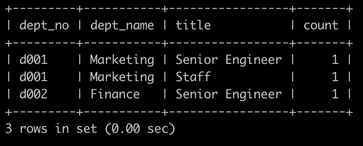

```sql
select 
de.dept_no
,d.dept_name
,t.title
,count(1) as count
from dept_emp de
inner join titles t
on de.emp_no = t.emp_no
and de.to_date = '9999-01-01'
and t.to_date = '9999-01-01'
inner join departments d
on de.dept_no = d.dept_no
group by 
de.dept_no
,d.dept_name
,t.title
order by de.dept_no asc;
```

### 28.查找描述信息中包括robot的电影对应的分类名称以及电影数目

## 描述

film表 

| 字段        | 说明         |
| ----------- | ------------ |
| film_id     | 电影id       |
| title       | 电影名称     |
| description | 电影描述信息 |


> CREATE TABLE IF NOT EXISTS film ( 
>
> film_id smallint(5)  NOT NULL DEFAULT '0', 
>
> title varchar(255) NOT NULL, 
>
> description text, 
>
> PRIMARY KEY (film_id)); 

category表 

| 字段        | 说明                 |
| ----------- | -------------------- |
| category_id | 电影分类id           |
| name        | 电影分类名称         |
| last_update | 电影分类最后更新时间 |


> CREATE TABLE category  ( 
>
> category_id  tinyint(3)  NOT NULL , 
>
> name  varchar(25) NOT NULL, `last_update` timestamp, 
>
> PRIMARY KEY ( category_id )); 

film_category表 

| 字段        | 说明                                 |
| ----------- | ------------------------------------ |
| film_id     | 电影id                               |
| category_id | 电影分类id                           |
| last_update | 电影id和分类id对应关系的最后更新时间 |


> CREATE TABLE film_category  ( 
>
> film_id  smallint(5)  NOT NULL, 
>
> category_id  tinyint(3)  NOT NULL, `last_update` timestamp); 

查找描述信息(film.description)中包含robot的电影对应的分类名称(category.name)以及电影数目(count(film.film_id))，而且还需要该分类包含电影总数量(count(film_category.category_id))>=5部 

如：输入为: 

```sql
INSERT INTO film VALUES(1,'ACADEMY DINOSAUR','A Epic Drama of a Feminist And a Mad Scientist who must Battle a Teacher in The Canadian Rockies');
INSERT INTO film VALUES(2,'ACE GOLDFINGER','A Astounding Epistle of a Database Administrator And a Explorer who must Find a Car in Ancient China');
INSERT INTO film VALUES(3,'ADAPTATION HOLES','A Astounding Reflection of a Lumberjack And a Car who must Sink a Lumberjack in A Baloon Factory');
INSERT INTO film VALUES(4,'AFFAIR PREJUDICE','A Fanciful Documentary of a Frisbee And a Lumberjack who must Chase a Monkey in A Shark Tank');
INSERT INTO film VALUES(5,'AFRICAN EGG','A Fast-Paced Documentary of a Pastry Chef And a Dentist who must Pursue a Forensic Psychologist in The Gulf of Mexico');
INSERT INTO film VALUES(6,'AGENT TRUMAN','A Intrepid Panorama of a robot And a Boy who must Escape a Sumo Wrestler in Ancient China');
INSERT INTO film VALUES(7,'AIRPLANE SIERRA','A Touching Saga of a Hunter And a Butler who must Discover a Butler in A Jet Boat');
INSERT INTO film VALUES(8,'AIRPORT POLLOCK','A Epic Tale of a Moose And a Girl who must Confront a Monkey in Ancient India');
INSERT INTO film VALUES(9,'ALABAMA DEVIL','A Thoughtful Panorama of a Database Administrator And a Mad Scientist who must Outgun a Mad Scientist in A Jet Boat');
INSERT INTO film VALUES(10,'ALADDIN CALENDAR','A Action-Packed Tale of a Man And a Lumberjack who must Reach a Feminist in Ancient China');

INSERT INTO category VALUES(1,'Action','2006-02-14 20:46:27');
INSERT INTO category VALUES(2,'Animation','2006-02-14 20:46:27');
INSERT INTO category VALUES(3,'Children','2006-02-14 20:46:27');
INSERT INTO category VALUES(4,'Classics','2006-02-14 20:46:27');
INSERT INTO category VALUES(5,'Comedy','2006-02-14 20:46:27');
INSERT INTO category VALUES(6,'Documentary','2006-02-14 20:46:27');
INSERT INTO category VALUES(7,'Drama','2006-02-14 20:46:27');
INSERT INTO category VALUES(8,'Family','2006-02-14 20:46:27');
INSERT INTO category VALUES(9,'Foreign','2006-02-14 20:46:27');
INSERT INTO category VALUES(10,'Games','2006-02-14 20:46:27');
INSERT INTO category VALUES(11,'Horror','2006-02-14 20:46:27');
INSERT INTO category VALUES(12,'Music','2006-02-14 20:46:27');
INSERT INTO category VALUES(13,'New','2006-02-14 20:46:27');
INSERT INTO category VALUES(14,'Sci-Fi','2006-02-14 20:46:27');
INSERT INTO category VALUES(15,'Sports','2006-02-14 20:46:27');
INSERT INTO category VALUES(16,'Travel','2006-02-14 20:46:27');

INSERT INTO film_category VALUES(1,6,'2006-02-14 21:07:09');
INSERT INTO film_category VALUES(2,11,'2006-02-14 21:07:09');
INSERT INTO film_category VALUES(3,6,'2006-02-14 21:07:09');
INSERT INTO film_category VALUES(4,11,'2006-02-14 21:07:09');
INSERT INTO film_category VALUES(5,6,'2006-02-14 21:07:09');
INSERT INTO film_category VALUES(6,6,'2006-02-14 21:07:09');
INSERT INTO film_category VALUES(7,5,'2006-02-14 21:07:09');
INSERT INTO film_category VALUES(8,6,'2006-02-14 21:07:09');
INSERT INTO film_category VALUES(9,11,'2006-02-14 21:07:09');
INSERT INTO film_category VALUES(10,15,'2006-02-14 21:07:09');

```


输出为: 

| 分类名称category.name | 电影数目count(film.film_id) |
| --------------------- | --------------------------- |
| Documentary           | 1                           |

```sql

# CREATE TABLE IF NOT EXISTS film (
# film_id smallint(5)  NOT NULL DEFAULT '0',
# title varchar(255) NOT NULL,
# description text, # robot
# PRIMARY KEY (film_id));

# CREATE TABLE category  (
# category_id  tinyint(3)  NOT NULL ,
# name  varchar(25) NOT NULL, `last_update` timestamp,
# PRIMARY KEY ( category_id ));

# CREATE TABLE film_category  (
# film_id  smallint(5)  NOT NULL,
# category_id  tinyint(3)  NOT NULL, `last_update` timestamp);


# 查找描述信息(film.description)中包含robot的电影对应的分类名称(category.name)以及电影数目(count(film.film_id))，而且还需要该分类包含电影总数量(count(film_category.category_id))>=5部


select ca.name,count(fca.film_id) as num
from category ca
inner join film_category fca
on ca.category_id = fca.category_id
inner join (
select * from film f where f.description like '%robot%'
) f on f.film_id = fca.film_id
inner join (
select 
    fc.film_id
    ,fc.category_id
    ,count(fc.film_id) as num
    from film_category fc
    group by fc.category_id
    having num >=5
) fc on fc.category_id = fca.category_id;
```

### 29.**使用join查询方式找出没有分类的电影id以及名称**

film表 

| 字段        | 说明         |
| ----------- | ------------ |
| film_id     | 电影id       |
| title       | 电影名称     |
| description | 电影描述信息 |


> CREATE TABLE IF NOT EXISTS film ( 
>
> film_id smallint(5)  NOT NULL DEFAULT '0', 
>
> title varchar(255) NOT NULL, 
>
> description text, 
>
> PRIMARY KEY (film_id)); 

category表 

| 字段        | 说明                 |
| ----------- | -------------------- |
| category_id | 电影分类id           |
| name        | 电影分类名称         |
| last_update | 电影分类最后更新时间 |


> CREATE TABLE category  ( 
>
> category_id  tinyint(3)  NOT NULL , 
>
> name  varchar(25) NOT NULL, `last_update` timestamp, 
>
> PRIMARY KEY ( category_id )); 

film_category表 

| 字段        | 说明                                 |
| ----------- | ------------------------------------ |
| film_id     | 电影id                               |
| category_id | 电影分类id                           |
| last_update | 电影id和分类id对应关系的最后更新时间 |


> CREATE TABLE film_category  ( 
>
> film_id  smallint(5)  NOT NULL, 
>
> category_id  tinyint(3)  NOT NULL, `last_update` timestamp); 

使用join查询方式找出没有分类的电影id以及名称 

如输入为：

```sql
INSERT INTO film VALUES(1,'ACADEMY DINOSAUR','A Epic Drama of a Feminist And a Mad Scientist who must Battle a Teacher in The Canadian Rockies');
INSERT INTO film VALUES(2,'ACE GOLDFINGER','A Astounding Epistle of a Database Administrator And a Explorer who must Find a Car in Ancient China');
INSERT INTO film VALUES(3,'ADAPTATION HOLES','A Astounding Reflection of a Lumberjack And a Car who must Sink a Lumberjack in A Baloon Factory');

INSERT INTO category VALUES(1,'Action','2006-02-14 20:46:27');
INSERT INTO category VALUES(2,'Animation','2006-02-14 20:46:27');
INSERT INTO category VALUES(3,'Children','2006-02-14 20:46:27');
INSERT INTO category VALUES(4,'Classics','2006-02-14 20:46:27');
INSERT INTO category VALUES(5,'Comedy','2006-02-14 20:46:27');
INSERT INTO category VALUES(6,'Documentary','2006-02-14 20:46:27');
INSERT INTO category VALUES(7,'Drama','2006-02-14 20:46:27');
INSERT INTO category VALUES(8,'Family','2006-02-14 20:46:27');
INSERT INTO category VALUES(9,'Foreign','2006-02-14 20:46:27');
INSERT INTO category VALUES(10,'Games','2006-02-14 20:46:27');
INSERT INTO category VALUES(11,'Horror','2006-02-14 20:46:27');

INSERT INTO film_category VALUES(1,6,'2006-02-14 21:07:09');
INSERT INTO film_category VALUES(2,11,'2006-02-14 21:07:09');

```

输出为： 

| 电影id | 名称             |
| ------ | ---------------- |
| 3      | ADAPTATION HOLES |