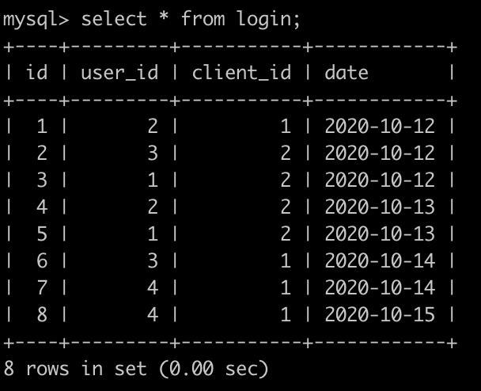

### 62.**出现三次以上相同积分的情况**

在牛客刷题的小伙伴们都有着牛客积分，积分(grade)表简化可以如下:


id为用户主键id，number代表积分情况，让你写一个sql查询，积分表里面出现三次以及三次以上的积分，查询结果如下:


```mysql
select 
number
from grade
group by number
having count(1) >=3;
```


### 63.**刷题通过的题目排名**

在牛客刷题有一个通过题目个数的(passing_number)表，id是主键，简化如下:


第1行表示id为1的用户通过了4个题目;.....第6行表示id为6的用户通过了4个题目;请你根据上表，输出通过的题目的排名，通过题目个数相同的，排名相同，此时按照id升序排列，数据如下:


id为5的用户通过了5个排名第1，id为1和id为6的都通过了2个，并列第2

```sql
select
*,dense_rank() over(order by number desc) as 't_rank'
from passing_number
order by number desc ,id asc;

```

### 64.找到每个人的任务

有一个person表，主键是id，如下:


有一个任务(task)表如下，主键也是id，如下:


请你找到每个人的任务情况，并且输出出来，没有任务的也要输出，而且输出结果按照person的id升序排序，输出情况如下:


```mysql
# person
# task
# 请你找到每个人的任务情况，并且输出出来，没有任务的也要输出，而且输出结果按照person的id升序排序，输出情况如下:


select a.id,a.name,b.content
from person a
left join
task b
on a.id = b.person_id
order by a.id asc;
```

### 66.**牛客每个人最近的登录日期(一)**

牛客每天有很多人登录，请你统计一下牛客每个用户最近登录是哪一天。

有一个登录(login)记录表，简况如下:


第1行表示user_id为2的用户在2020-10-12使用了客户端id为1的设备登录了牛客网
。。。
第4行表示user_id为3的用户在2020-10-13使用了客户端id为2的设备登录了牛客网


请你写出一个sql语句查询每个用户最近一天登录的日子，并且按照user_id升序排序，上面的例子查询结果如下:

查询结果表明:
user_id为2的最近的登录日期在2020-10-13
user_id为3的最近的登录日期也是2020-10-13


```mysql
select
l.user_id,max(l.date) as d
from login l
group by l.user_id
order by l.user_id;
```

### 67.**牛客每个人最近的登录日期(二)**

牛客每天有很多人登录，请你统计一下牛客每个用户最近登录是哪一天，用的是什么设备.

有一个登录(login)记录表，简况如下:


第1行表示user_id为2的用户在2020-10-12使用了客户端id为1的设备登录了牛客网
。。。
第4行表示user_id为3的用户在2020-10-13使用了客户端id为2的设备登录了牛客网

还有一个用户(user)表，简况如下:


还有一个客户端(client)表，简况如下:


请你写出一个sql语句查询每个用户最近一天登录的日子，用户的名字，以及用户用的设备的名字，并且查询结果按照user的name升序排序，上面的例子查询结果如下:


查询结果表明:
fh最近的登录日期在2020-10-13，而且是使用ios登录的
wangchao最近的登录日期也是2020-10-13，而且是使用ios登录的

```mysql
select u.name u_n,c.name c_n,l.date
from login l inner join user u on l.user_id=u.id
inner join client c on l.client_id=c.id
where (l.user_id,l.date) in
(select user_id,max(date) from login group by user_id)
order by u_n;
```

### 68.**牛客每个人最近的登录日期(三)**

牛客每天有很多人登录，请你统计一下牛客新登录用户的次日成功的留存率，
有一个登录(login)记录表，简况如下:

第1行表示user_id为2的用户在2020-10-12使用了客户端id为1的设备第一次新登录了牛客网
。。。

第4行表示user_id为3的用户在2020-10-12使用了客户端id为2的设备登录了牛客网

。。。

最后1行表示user_id为1的用户在2020-10-14使用了客户端id为2的设备登录了牛客网


请你写出一个sql语句查询新登录用户次日成功的留存率，即第1天登陆之后，第2天再次登陆的概率,保存小数点后面3位(3位之后的四舍五入)，上面的例子查询结果如下:


查询结果表明:

user_id为1的用户在2020-10-12第一次新登录了，在2020-10-13又登录了，算是成功的留存

user_id为2的用户在2020-10-12第一次新登录了，在2020-10-13又登录了，算是成功的留存

user_id为3的用户在2020-10-12第一次新登录了，在2020-10-13没登录了，算是失败的留存

user_id为4的用户在2020-10-13第一次新登录了，在2020-10-14没登录了，算是失败的留存

固次日成功的留存率为 2/4=0.5

(sqlite里查找某一天的后一天的用法是:date(yyyy-mm-dd, '+1 day')，四舍五入的函数为round，sqlite 1/2得到的不是0.5，得到的是0，只有1*1.0/2才会得到0.5

mysql里查找某一天的后一天的用法是:DATE_ADD(yyyy-mm-dd,INTERVAL 1 DAY)，四舍五入的函数为round)

```mysql
select round(count(distinct l.user_id)*1.0/(select count(distinct user_id) from login),3) as p 
from login l
where (l.user_id,l.date) in (select l.user_id,date_add(min(l.date),interval 1 day)
                             from login l group by l.user_id);


select round(count(l2.date)/count(*),3) p
from (select user_id,min(date) first_date from login group by user_id) l1
left join login l2 on l1.user_id =l2.user_id 
and l2.date=date_add(l1.first_date,interval 1 day)
```

### 69.**牛客每个人最近的登录日期(四)**

牛客每天有很多人登录，请你统计一下牛客每个日期登录新用户个数，
有一个登录(login)记录表，简况如下:

第1行表示user_id为2的用户在2020-10-12使用了客户端id为1的设备登录了牛客网，因为是第1次登录，所以是新用户
。。。
第4行表示user_id为2的用户在2020-10-13使用了客户端id为2的设备登录了牛客网，因为是第2次登录，所以是老用户
。。
最后1行表示user_id为4的用户在2020-10-15使用了客户端id为1的设备登录了牛客网，因为是第2次登录，所以是老用户


请你写出一个sql语句查询每个日期登录新用户个数，并且查询结果按照日期升序排序，上面的例子查询结果如下:


查询结果表明:
2020-10-12，有3个新用户(user_id为2，3，1)登录
2020-10-13，没有新用户登录
2020-10-14，有1个新用户(user_id为4)登录
2020-10-15，没有新用户登录

```mysql
#明确问题：登录的当前日期=该用户所有登录日期的最小值
#方法一：计数神器——sum+case方法，不容易出错。
#【易错点】group by 后面不需要加distinct
select distinct date
        ,sum(case when (user_id,date) in 
    (select user_id,min(date)from login group by user_id)
    then 1 else 0 end)
from login
group by date
order by date;


#这个题目做过前面的题的话，应该可以比较容易就知道，
select l1.date,count(distinct l1.user_id)
from login l1
group by l1.date;
#这样可以得到每个日期里面，用户登录的数目，比较简单，所以在加一个where判断条件就能从这每个日期里面，用户登录的数目取出哪些是新用户，如下：
select l1.date,count(distinct l1.user_id)
from login l1
where l1.date =
(select min(date) from login where user_id=l1.user_id)
group by l1.date;
#当这个日期，正好是这个用户登录的最小日期，而且用户id相同时，那么肯定就是这个日期登录的新用户，执行的用例的话，得到的结果应该如下:
2020-10-12|3
2020-10-14|1
#但是这样并不能通过用例，因为这样的话，2020-10-13没有新用户登录，应该输出为0的，这个语句却没有输出。但是login表的日期是完整的，所以我们考虑将login表当主表，上面查出来的表左连接到主表，顺序输出，并使用ifnull语句将null变成0，最后再加上一个order by语句，就可以得到题目想要的结果了:
select login.date,ifnull(n1.new_num,0)
from login 
left join 
(select l1.date,count(distinct l1.user_id) as new_num
from login l1
where l1.date =
(select min(date) from login where user_id=l1.user_id)
group by l1.date) n1
on login.date = n1.date
group by login.date order by login.date
# 借鉴下他人的mysql使用窗口函数的写法:(mysql8.0里面rank是关键字，不能直接使用)
select a.date,
sum(case when t_rank=1 then 1 else 0 end) new
from 
(select date, row_number() over(partition by user_id order by date) t_rank
from login) a
group by date;
```