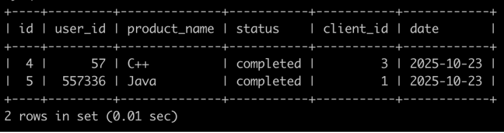

### 70.**牛客每个人最近的登录日期(五)**

牛客每天有很多人登录，请你统计一下牛客每个日期新用户的次日留存率。
有一个登录(login)记录表，简况如下:

第1行表示user_id为2的用户在2020-10-12使用了客户端id为1的设备登录了牛客网，因为是第1次登录，所以是新用户
。。。
第4行表示user_id为2的用户在2020-10-13使用了客户端id为2的设备登录了牛客网，因为是第2次登录，所以是老用户
。。
最后1行表示user_id为4的用户在2020-10-15使用了客户端id为1的设备登录了牛客网，因为是第2次登录，所以是老用户


请你写出一个sql语句查询每个日期新用户的次日留存率，结果保留小数点后面3位数(3位之后的四舍五入)，并且查询结果按照日期升序排序，上面的例子查询结果如下:

查询结果表明:
2020-10-12登录了3个(user_id为2，3，1)新用户，2020-10-13，只有2个(id为2,1)登录，故2020-10-12新用户次日留存率为2/3=0.667;
2020-10-13没有新用户登录，输出0.000;
2020-10-14登录了1个(user_id为4)新用户，2020-10-15，user_id为4的用户登录，故2020-10-14新用户次日留存率为1/1=1.000;

2020-10-15没有新用户登录，输出0.000;

(注意:sqlite里查找某一天的后一天的用法是:date(yyyy-mm-dd, '+1 day')，sqlite里1/2得到的不是0.5，得到的是0，只有1*1.0/2才会得到0.5)


牛客网SQL第70题。互联网公司经常要统计新用户留存率，所以是很有价值的一题，简单写下思路。
我们最终需要的表结构大致如下，用集合的思想来理解，以date对整体进行划分，划分完之后每个结合里需要包括每个date的新用户数，每个date的留存用户数，这两部分相除组成留存率。

```mysql

```

### 72.**考试分数(一)**

##  描述

牛客每次考试完，都会有一个成绩表(grade)，如下:


第1行表示用户id为1的用户选择了C++岗位并且考了11001分

。。。

第8行表示用户id为8的用户选择了JS岗位并且考了9999分


请你写一个sql语句查询各个岗位分数的平均数，并且按照分数降序排序，结果保留小数点后面3位(3位之后四舍五入):


(注意: sqlite 1/2得到的不是0.5，得到的是0，只有1*1.0/2才会得到0.5，sqlite四舍五入的函数为round)


```mysql
select
g.job
,round(avg(score),3) as avg
from grade g
group by g.job
order by avg desc;
```

### 73.**SQL73** **考试分数(二)**

牛客每次考试完，都会有一个成绩表(grade)，如下:


第1行表示用户id为1的用户选择了C++岗位并且考了11001分

。。。

第8行表示用户id为8的用户选择了前端岗位并且考了9999分


请你写一个sql语句查询用户分数大于其所在工作(job)分数的平均分的所有grade的属性，并且以id的升序排序，如下:


(注意: sqlite 1/2得到的不是0.5，得到的是0，只有1*1.0/2才会得到0.5，sqlite四舍五入的函数为round)

```mysql
#1、求解平均分
  select b.job,avg(b.score) as pp
  from grade b
  group by b.job;
#2、查找所有的id,job，以及分数
select a.id ,a.job,a.score
from grade a;
#3、左连接+筛选（高于平均值）
select a.id ,a.job,a.score
from grade a
left join 
(select b.job,avg(b.score) as pp
 from grade b
 group by b.job
) as c
on a.job = c.job
where a.score > c.pp
#注意：第二个select一定要起一个别名,否则会出错
#4、升序
select a.id ,a.job,a.score
from grade a
left join 
(select b.job,avg(b.score) as pp
 from grade b
 group by b.job
) as c
on a.job = c.job
where a.score > c.pp
order by a.id;
#############################################
select g.id,g.job,g.score
from grade g left join (
select gg.job,avg(gg.score) as pp from grade gg
    group by gg.job
) gr  on g.job = gr.job
where g.score > gr.pp
order by g.id asc;
```

### 74.**SQL74** **考试分数(三)**

牛客每次举办企业笔试的时候，企业一般都会有不同的语言岗位，比如C++工程师，JAVA工程师，Python工程师，每个用户笔试完有不同的分数，现在有一个分数(grade)表简化如下:

第1行表示用户id为1的选择了language_id为1岗位的最后考试完的分数为12000，
....
第7行表示用户id为7的选择了language_id为2岗位的最后考试完的分数为11000，

不同的语言岗位(language)表简化如下:


请你找出每个岗位分数排名前2名的用户，得到的结果先按照language的name升序排序，再按照积分降序排序，最后按照grade的id升序排序，得到结果如下:


```mysql
# way-1,dense_rank
select b.id,l.name,b.score
from language l inner join 
(
select g.id,g.language_id,g.score,dense_rank() over(partition by g.language_id order by g.score desc) as rn
from grade g) b
on l.id = b.language_id
where b.rn <= 2
order by l.name asc,b.score desc;
# way-2
with g as
(
    select *,
           dense_rank() over(partition by language_id order by score desc) as g_rank
    from grade
)
select g.id,l.name,g.score
from g join language l 
      on g.language_id=l.id
where g.g_rank<=2
order by l.name,g.score desc,g.id；
# way-3 不用开窗函数


```

### 77.**SQL77** **牛客的课程订单分析(一)**

## 描述

有很多同学在牛客购买课程来学习，购买会产生订单存到数据库里。

有一个订单信息表(order_info)，简况如下:


第1行表示user_id为557336的用户在2025-10-10的时候使用了client_id为1的客户端下了C++课程的订单，但是状态为没有购买成功。

第2行表示user_id为230173543的用户在2025-10-12的时候使用了client_id为2的客户端下了Python课程的订单，状态为购买成功。

。。。

最后1行表示user_id为557336的用户在2025-10-24的时候使用了client_id为1的客户端下了Python课程的订单，状态为没有购买成功。


请你写出一个sql语句查询在2025-10-15以后状态为购买成功的C++课程或者Java课程或者Python的订单，并且按照order_info的id升序排序，以上例子查询结果如下:



## 示例1

```mysql
drop table if exists order_info;
CREATE TABLE order_info (
id int(4) NOT NULL,
user_id int(11) NOT NULL,
product_name varchar(256) NOT NULL,
status varchar(32) NOT NULL,
client_id int(4) NOT NULL,
date date NOT NULL,
PRIMARY KEY (id));

INSERT INTO order_info VALUES
(1,557336,'C++','no_completed',1,'2025-10-10'),
(2,230173543,'Python','completed',2,'2025-10-12'),
(3,57,'JS','completed',3,'2025-10-23'),
(4,57,'C++','completed',3,'2025-10-23'),
(5,557336,'Java','completed',1,'2025-10-23'),
(6,557336,'Python','no_completed',1,'2025-10-24');
```

```mysql
```

