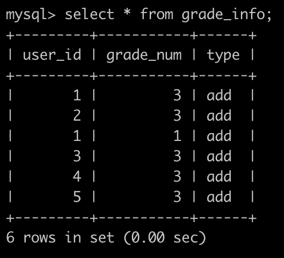
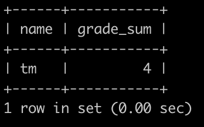

### 89.**SQL89** **获得积分最多的人(一)**

## 描述

牛客每天有很多用户刷题，发帖，点赞，点踩等等，这些都会记录相应的积分。

有一个用户表(user)，简况如下：


还有一个积分表(grade_info)，简况如下:



第1行表示，user_id为1的用户积分增加了3分。

第2行表示，user_id为2的用户积分增加了3分。

第3行表示，user_id为1的用户积分又增加了1分。

.......

最后1行表示，user_id为5的用户积分增加了3分。

请你写一个SQL查找积分增加最高的用户的名字，以及他的总积分是多少(此题数据保证积分最高的用户有且只有1个)，以上例子查询结果如下:



解释:

user_id为1的总计加了4分，其他的都是3分，user_id为1的name为tm

输出tm|4

## 示例1

```mysql
drop table if exists user;
drop table if exists grade_info;

CREATE TABLE user (
id  int(4) NOT NULL,
name varchar(32) NOT NULL
);

CREATE TABLE grade_info (
user_id  int(4) NOT NULL,
grade_num int(4) NOT NULL,
type varchar(32) NOT NULL
);

INSERT INTO user VALUES
(1,'tm'),
(2,'wwy'),
(3,'zk'),
(4,'qq'),
(5,'lm');

INSERT INTO grade_info VALUES
(1,3,'add'),
(2,3,'add'),
(1,1,'add'),
(3,3,'add'),
(4,3,'add'),
(5,3,'add');
```

```mysql
# way-1
select 
b.name
,a.gsum
from (
select 
gi.user_id
,sum(gi.grade_num) over(partition by gi.user_id) as gsum
from grade_info gi order by gsum desc limit 1) a
inner join user b
on a.user_id = b.id;
```

