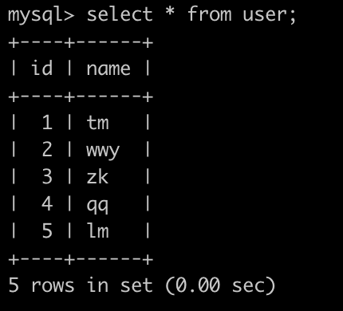
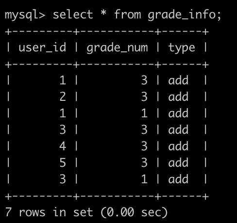
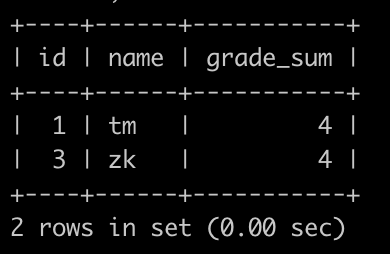

##### 当使用print输出对象的时候，若定义了__str__(self)方法，打印对象时就会从这个方法中打印出return的z字符串数据。__str__方法用例：

```python
class Person:
    """
    定义一个人“类”
    """
    def __init__(self,name,weight):
        self.name = name
        self.weight = weight
    def __str__(self):
        return "我的名字叫%s 体重是%.2fkg" % (self.name,self.weight)
#创建2个对象
xiaoming = Person("小明",56)
xiaomei = Person("小美",44)
print(xiaoming)
print(xiaomei)
输出结果：我的名字叫小明 体重是56.00kg
		 我的名字叫小美 体重是44.00kg

```

##### 若将__str__方法注释之后，print输出对象变量，默认情况下，是输出这个变量引用的对象是由哪一个类创建的对象，以及在内存中的地址，如：

```python
class Person:
    """
    定义一个人“类”
    """
    def __init__(self,name,weight):
        self.name = name
        self.weight = weight
    #def __str__(self):
    #   return "我的名字叫%s 体重是%.2fkg" % (self.name,self.weight)

xiaoming = Person("小明",56)
print(xiaoming)
输出结果：<__main__.Person object at 0x00000000026F90F0>

```

### 90. **SQL90** **获得积分最多的人(二)**

## 描述

牛客每天有很多用户刷题，发帖，点赞，点踩等等，这些都会记录相应的积分。

有一个用户表(user)，简况如下：



还有一个积分表(grade_info)，简况如下:



第1行表示，user_id为1的用户积分增加了3分。

第2行表示，user_id为2的用户积分增加了3分。

第3行表示，user_id为1的用户积分又增加了1分。

.......

最后1行表示，user_id为3的用户积分增加了1分。

请你写一个SQL查找积分增加最高的用户的id(可能有多个)，名字，以及他的总积分是多少，查询结果按照id升序排序，以上例子查询结果如下:



解释:

user_id为1和3的2个人，积分都为4，都要输出

## 示例1

```mysql
drop table if exists user;
drop table if exists grade_info;

CREATE TABLE user (
id  int(4) NOT NULL,
name varchar(32) NOT NULL
);

CREATE TABLE grade_info (
user_id  int(4) NOT NULL,
grade_num int(4) NOT NULL,
type varchar(32) NOT NULL
);

INSERT INTO user VALUES
(1,'tm'),
(2,'wwy'),
(3,'zk'),
(4,'qq'),
(5,'lm');

INSERT INTO grade_info VALUES
(1,3,'add'),
(2,3,'add'),
(1,1,'add'),
(3,3,'add'),
(4,3,'add'),
(5,3,'add'),
(3,1,'add'); 
```

