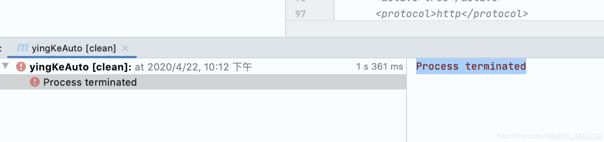
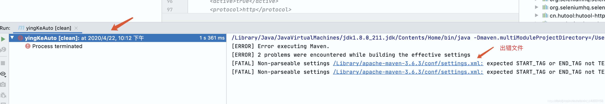
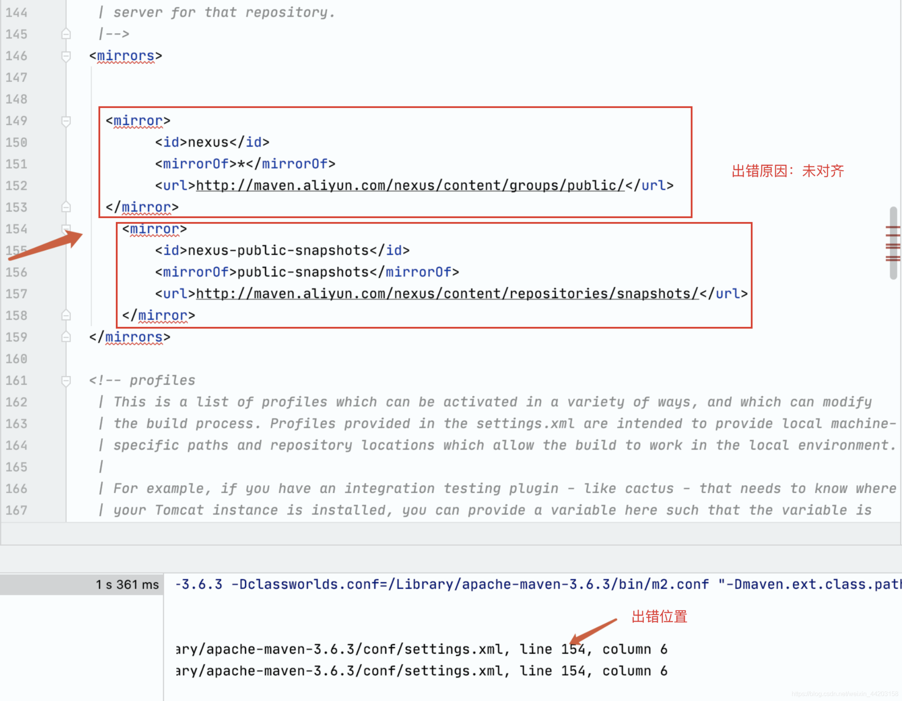

# maven编译 Process terminated【已解决】

▐ maven项目编译报错如下：

▐ 点击【项目名】提示找到出错文件

▐ 点击查看出错文件
在idea中打开了settings文件，找到提示的报错位置

▐ 原因及解决办法
原因 ：缩进或者空格不一致导致该问题
解决办法：格式化编辑好之后复制再粘贴过来就可以了(推荐 👉XML 在线格式化)
------------------------------------------------