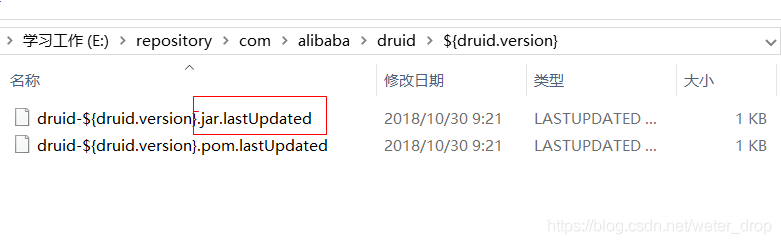
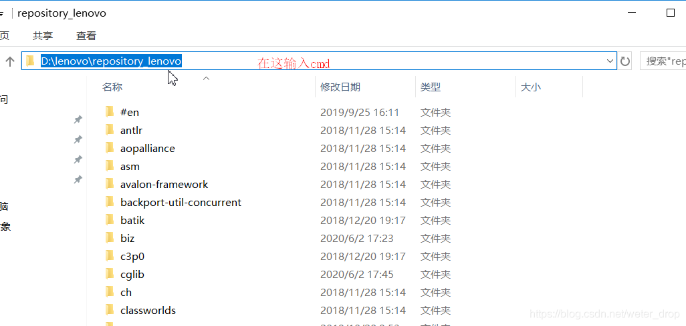
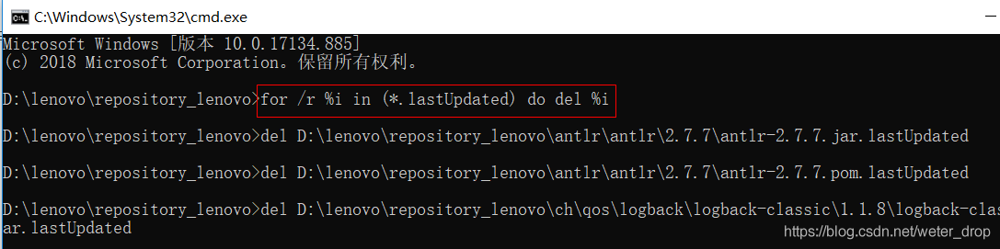

# 一、问题描述

maven是现在使用比较广泛的一个项目构建工具，但是碰见我们网络情况不好的时候，或者自己指定的maven仓库中没有自己pom文件中定义的jar则会在本地仓库中出现一个以 .lastUpdated 为后缀的未完成的jar包，如下图所示：



# 二、解决方案

但是等我们网络好了，或者重新指定的有我们需要的jar包的maven仓库时，发现还是无法下载，经过多次尝试，发现可以将这个没有下载完成的jar文件 直接删除 即可重新下载,但是如果有多个依赖有这样的问题，一个一个的手动去删除，太浪费时间，我们可以尝试以下步骤快速删除我们本地的maven仓库中 以 .lastUpdated 后缀结尾的所有未下载完成的jar。

## 1. 进入maven本地仓库地址：

CMD进入windows的路径(或在仓库目录的地址栏直接输入CMD，回车自动打开);



## 2. 执行如下命令，进行递归删除

```cmd
for /r %i in (*.lastUpdated) do del %i
```



