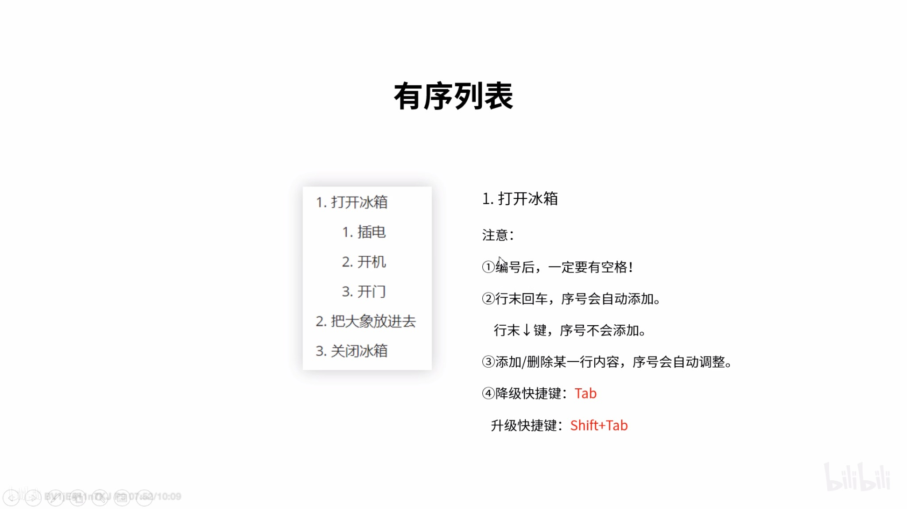

# Typora编辑器----书写即为美学

支持平台：

- Windows

- Linux
- OSX

特点：

- 支持Github和Markdown语法；
- 人性化的书写方式：
  - 表格的书写、挪动
  - 图片、超链接网页表格复制；
  - 目录生成；

- 支持LeTex公式书写；
- 支持Flowchart,Mermaid等落成图绘制；
- emoji，高亮，备注，上标，下标等书写；
- 生成网页，pdf，图片，甚至world，LeTex等格式。

## 基本的带快捷键的Markdown书写演示

```
command 1 到 command 6:普通文本，一级～六级标题；
```

```
command B:加粗，加粗测试
```




